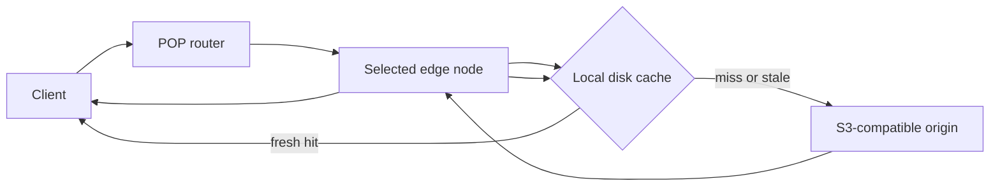
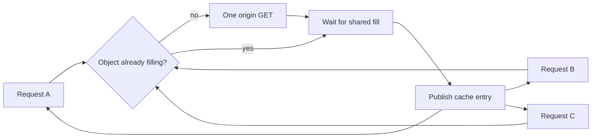
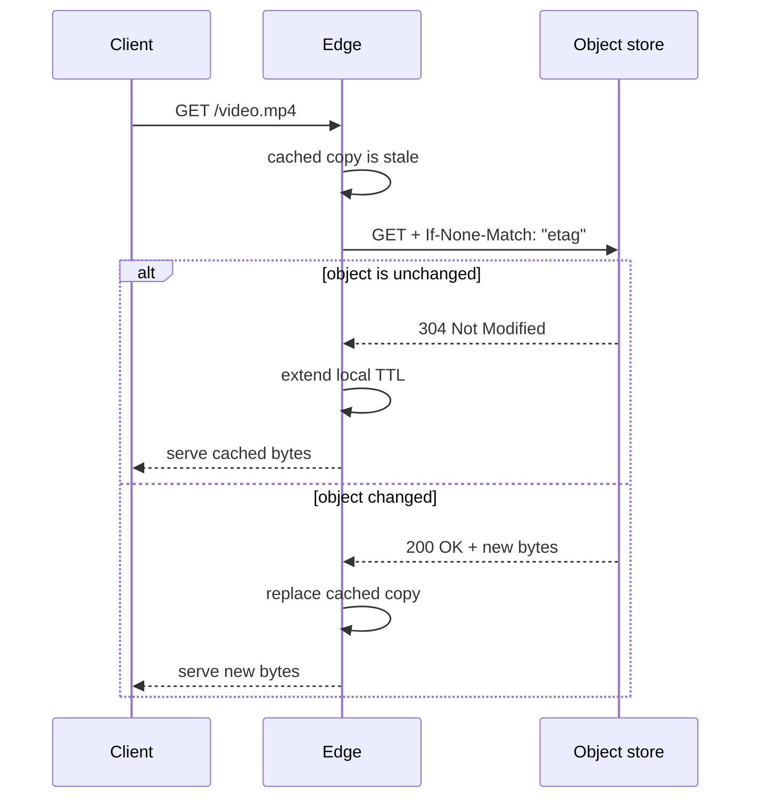
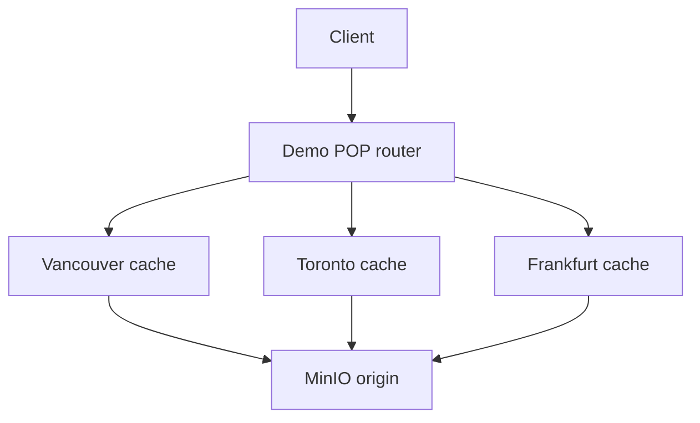

I started this project after reading about systems that keep durable state in object storage and move active data into faster local tiers. Turbopuffer was one example, but the pattern is broader: keep the source of truth in durable storage, then use local disks or memory to make the active path fast.

That led me to a smaller question. If the object store already holds the bytes, how far can I get by putting caches in front of it and treating each cache server as an edge location?

Putting a Node server in front of S3 is easy. The interesting work begins when it must decide whether cached bytes are still valid, prevent a burst from producing duplicate origin reads, serve ranges from large files, and keep caches at different locations independent.

I built [`object-edge`](https://github.com/rowlandekemezie/object-edge) to explore that path. It is a small TypeScript implementation with S3-compatible object storage as the durable origin, a disk cache at each logical point of presence, and a router that moves the same request through different edge nodes.

I first built the adapter around AWS S3. I then widened the boundary to Cloudflare R2 and MinIO without adding a provider switch. The implementation depends on a small part of the S3 protocol rather than an AWS SDK or an AWS-only abstraction.

## The basic path



The router chooses an edge node. The edge checks its local disk. A fresh object is served locally, while a missing or stale object goes back to the configured origin.

The edge owns no durable state. If I remove the Vancouver cache, the object still exists in the object store, and the next request can fill the cache again. Each cache is disposable, but a cold request still depends on the origin.

## What S3-compatible means here

The origin adapter relies on a small contract:

- a signed `GetObject` request;
- `Range` for partial reads;
- `If-None-Match` for ETag revalidation;
- response metadata such as `Cache-Control`, ETag, content type, and content length.

AWS S3 supports that contract. MinIO implements it locally. Cloudflare documents the same operations for R2, with Signature Version 4 and the signing region set to `auto`.

The implementation has one adapter and three configurations:

| Origin | Endpoint style | Signing region | What the project verifies |
| --- | --- | --- | --- |
| AWS S3 | AWS virtual-hosted URL | Bucket region | URL construction and AWS's published SigV4 reference vector |
| Cloudflare R2 | `<bucket>.<account>.r2.cloudflarestorage.com` | `auto` | URL construction and signed conditional range requests |
| MinIO | Path-style local endpoint | `us-east-1` | The complete request path through Docker Compose |

This does not mean that every S3 feature behaves identically across all three systems. It means the narrow contract used by this project is portable. The R2 tests validate Cloudflare's documented request shape without putting account credentials in CI, while MinIO provides a real object store for the end-to-end test.

## The cache key needed more than the object path

Broadening the origin exposed a correctness problem in the first design.

The disk cache was keyed only by the object key. That works while one cache directory always points to one bucket, but it breaks when the origin changes. AWS S3 and R2 can both contain `images/logo.png`, and there is no reason to assume those objects contain the same bytes.

If I changed the configuration from an S3 bucket to an R2 bucket but reused the same cache directory, the old implementation could return the cached S3 object without asking R2.

The fix was to make the origin part of cache identity:

```text
cache identity = origin endpoint + bucket + object key
```

The code remains small:

```ts
private cacheIdentity(originKey: string): string {
	return `${this.origin.cacheNamespace}\0${originKey}`
}
```

The origin namespace is derived from the resolved bucket endpoint, and the disk cache hashes the combined value before creating file paths. Two origins can now use the same object key without making their cached bytes interchangeable.

This is not yet a complete HTTP cache key. Query parameters, `Accept-Encoding`, authorization, and `Vary` are not included. The current design assumes that one edge process serves one configured object origin and that the object key identifies one representation. A multi-tenant CDN would need an explicit cache-key policy instead of that assumption.

## A cold miss can become an origin stampede

The naive miss path is straightforward: look on disk, fetch the object when it is absent, write it to disk, and return it.

The problem appears when a cold object becomes popular before the first origin request completes. If 100 requests arrive together, sending 100 copies of the same `GetObject` request wastes origin capacity and lets a traffic spike multiply behind the cache.

Each edge node therefore keeps an in-memory map of fills already in progress. The first request creates the fill. Later requests for the same cache identity wait for it.



The implementation uses a map and a shared promise:

```ts
const existing = this.inFlight.get(cacheIdentity)
if (existing) {
	return existing
}

const fill = this.fill(cacheIdentity, originKey, staleMetadata).finally(() =>
	this.inFlight.delete(cacheIdentity)
)
this.inFlight.set(cacheIdentity, fill)
return fill
```

An integration test sends 12 simultaneous requests to an empty cache. All 12 receive the object, while the fake origin records one read. The collapsing is local to a POP, so two cold POPs can still fetch the same object independently. Origin shielding would be the next layer if that became expensive.

## Freshness comes from object metadata

A cached file is only useful while the edge can decide whether it should still be served.

The project reads `s-maxage` or `max-age` from `Cache-Control`, refuses to cache `private` or `no-store` responses, and stores the object's ETag. When the local TTL expires, the edge revalidates the object with `If-None-Match`.



A `304 Not Modified` response lets the edge keep the local body instead of downloading it again. If the origin returns a new object, the edge writes it to a temporary file and renames the file into place after the download completes.

Once a complete object is cached, the edge can also serve byte ranges directly from disk. That matters for media and resumable downloads because a client may request only part of a large object.

This is a useful subset of HTTP caching, not the complete model. The project does not calculate `Age`, implement `stale-while-revalidate`, interpret `must-revalidate`, or vary representations by request headers.

## Three logical POPs make the distribution boundary visible

One cache server in front of an object store is a caching proxy. It does not become a CDN until requests can be distributed across edge locations.

The local demo runs three logical POPs—Vancouver, Toronto, and Frankfurt—behind a small router. A request header selects the POP so the behavior is easy to inspect.



The CI workflow starts the complete Docker Compose stack and checks this sequence:

| Request | Expected result |
| --- | --- |
| First request through Vancouver | `MISS` |
| Second request through Vancouver | `HIT` |
| First request through Toronto | `MISS` |

Toronto misses because it has a different cache volume. The router is still a simulation. A real CDN needs Anycast, latency-aware DNS, or another global traffic system, together with health-aware failover rather than a header that names a POP.

## R2 fits the same contract, but this proxy does not belong inside Workers

When code already runs in Cloudflare Workers, an R2 binding is a more direct path to object bytes than operating this Node service beside it. Cloudflare also documents how to place R2 responses in the Workers Cache API when application-controlled edge caching is useful.

Supporting R2 here serves a different purpose. It shows that the origin boundary is designed around a protocol contract rather than AWS-specific code, and it forced the cache identity to stop assuming that one object path belongs to one provider.

I did not use Durable Objects for the object bytes. Their stronger fit in this design would be a later control plane for purge versions, per-object coordination, or tenant configuration, while R2 or another object store continues to hold the bytes. That would be a separate experiment because it introduces distributed coordination, not another S3-compatible origin.

## Where the experiment stops

The project now has a working data path: signed origin reads, independent caches, request collapsing, revalidation, ranges, origin-aware cache identity, and a multi-POP demo.

It still lacks the parts that make a CDN safe to operate at scale:

- global traffic routing and failover;
- bounded eviction when disks fill;
- purge and invalidation across POPs;
- stream-through cache fills;
- origin shielding;
- TLS and certificate management;
- DDoS and WAF controls;
- tenant isolation and a complete cache-key policy;
- production metrics, logs, and tracing.

The cold path is the next implementation boundary I would explore. The current edge downloads the complete object to a temporary file before serving it from disk. A better first-request path would stream the bytes to the client and the temporary file together, then publish the cache entry only after the origin stream completes successfully.

That change affects failure handling, request collapsing, client cancellation, partial files, and what waiting requests are allowed to observe. It deserves its own implementation and article rather than being hidden inside this one.

So, how far can you get on top of S3-compatible object storage? Far enough to build the core data path and make the important cache behaviors observable. Not far enough to pretend that a few cache servers and a router are a production CDN.

The more useful result is knowing exactly where that line is.

## References

1. [Cloudflare R2 S3 API compatibility](https://developers.cloudflare.com/r2/api/s3/api/)
2. [Cloudflare R2 S3 configuration](https://developers.cloudflare.com/r2/get-started/s3/)
3. [Cloudflare R2 with the Workers Cache API](https://developers.cloudflare.com/r2/examples/cache-api/)
4. [AWS Signature Version 4 examples](https://docs.aws.amazon.com/AmazonS3/latest/API/sig-v4-header-based-auth.html)
