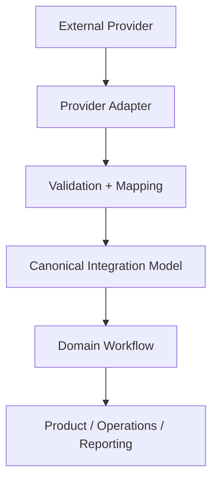
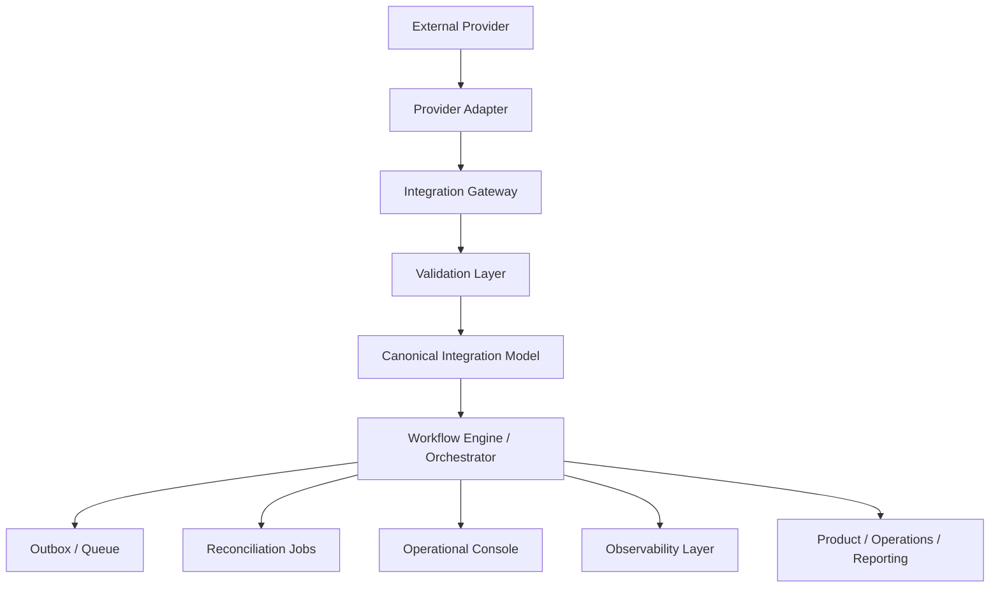

Most teams begin integration work as implementation work. They read the provider documentation, create an adapter, map a few fields, handle authentication, ship the feature, and move on. At the beginning, that can be enough because the problem still looks contained: one provider, one feature, a few endpoints, maybe a webhook.

The work changes once customers, revenue, operations, payroll, payments, compliance, or support workflows depend on the data moving correctly. The integration may still look like a connector in the codebase, but the business has already started treating it as infrastructure. From that point on, the important questions shift toward system design: how the domain should be modeled, how provider instability should be absorbed, how failure should be detected, how recovery can happen safely, and how the product can evolve without being rewritten every time an external system changes.

Integrations become dangerous when the business depends on them as infrastructure while the architecture still treats them as connectors.

## The simple integration does not stay simple

A team usually begins with a provider integration that looks small. The provider has a clean API, the docs describe the happy path, the SDK compiles, and the product requirement is narrow enough that someone writes code like this:

```ts
const customer = await provider.getCustomer(customerId)

await database.customers.update({
  id: customer.id,
  status: customer.status,
  email: customer.email,
})
```

Code like this is hard to argue with when the business is trying to ship. The provider gives you a customer, your database stores a customer, and the feature works until production starts adding details the documentation did not emphasize.

Providers return incomplete records. Webhooks arrive late. The same event is delivered twice. The docs describe a state machine nobody actually experiences. A customer asks why their status changed twice, support cannot explain what happened, and engineers add provider-specific conditional logic directly into product code. By the time a second provider becomes strategically important, the codebase may already treat the first provider's model as reality.

The earlier parts of this series build toward this point. [Part 1](https://rowlandekemezie.com/posts/integrations-start-where-api-documentation-ends/) argued that integrations start where API documentation ends because the work is owning the boundary between your product and an external system. [Part 2](https://rowlandekemezie.com/posts/external-systems-lie/) argued that external systems lie operationally because their data, events, timing, contracts, and behaviours cannot be treated as perfectly reliable. [Part 3](https://rowlandekemezie.com/posts/integration-systems-trusting-data/) argued that the hard part of synchronization is deciding what to believe once data flows between systems.

Part 4 follows from those arguments: once you accept that integrations are boundary systems operating against unreliable external reality, how should you build them?

## The first provider should not become your architecture

The most common mistake is designing the integration layer as one adapter per provider and letting the rest of the product handle everything else.

At first, this feels pragmatic. The provider has customers, so your application stores customers shaped like the provider. The provider has statuses, so your product uses those statuses. The provider has a workflow, so your UI reflects that workflow. The provider has error codes, so those error codes leak into support tooling and product logic.

Integration debt begins in that leakage. Provider objects make their way into internal models, product logic starts depending on provider-specific meanings, retry behaviour gets scattered, mapping rules become invisible, failure recovery depends on tribal knowledge, and adding a second provider multiplies complexity instead of abstracting it.

None of this means the first integration needs a grand platform. Premature abstraction is real, and a team can easily waste months building a universal integration framework before it understands the domain well enough to generalize anything. The more common failure is provider capture: the first provider becomes the architecture, its resource names become your names, and its quirks become invisible assumptions scattered throughout the codebase.

Premature abstraction is expensive, but provider capture is worse because it hides inside working code.

## Own the boundary between external behavior and internal meaning

A mature integration system needs an explicit boundary where external reality is translated into internal meaning. The boundary should include more than an SDK wrapper: provider adapters, canonical or internal models, mapping rules, validation, idempotency, sync state, error classification, retry and replay behaviour, audit logs, and observability.

A simple version of the architecture looks like this:



These layers exist because something outside your company can change without warning. The adapter should understand provider-specific behaviour such as authentication, pagination, rate limits, webhook signatures, raw payloads, strange enums, inconsistent timestamps, and endpoint-specific semantics. Validation and mapping should protect your system from treating external data as internal truth too early. The canonical integration model should express the internal meaning your product needs, while the domain workflow decides what the product believes, what state transitions are valid, what requires review, and what downstream effects should happen.

By the time data reaches product, operations, and reporting code, it should carry internal meaning rather than raw provider behaviour.

## Canonical models are useful, but only when they represent your business

Canonical models are useful because they prevent the product from becoming a mirror of every provider, but they are easy to abuse. A weak canonical model becomes a dumping ground for every field every provider exposes. It starts as a protective boundary and slowly turns into a giant compromise object with hundreds of optional fields, provider-specific escape hatches, ambiguous names, and unclear ownership.

A canonical model should capture the internal meaning your product needs, not every possible shape a provider can return. In payments, that might mean payment intent, payment attempt, settlement, failure reason, refund, dispute, and reconciliation state. In payroll, it might mean worker, earning, deduction, pay period, gross-to-net calculation, remittance, adjustment, payment execution, and filing state.

The aggressive version of the rule is that a canonical model is a decision about what your business believes the object means, not a dumping ground for provider fields. Revisit that decision as the integration matures, but keep provider-specific meaning away from parts of the product that should not know the provider exists.

## Design around commands, events, state, and reconciliation

Many integration failures happen because teams think only in request and response terms. Request and response describes the shape of an API call, while the business process usually unfolds over time.

A provider may accept a request now and process it later. A webhook may arrive before the API reflects the updated state. A status may move from pending to failed to retrying to completed. A record may be corrected days later. A customer may change something externally that your system needs to discover. A provider may time out after successfully processing your request.

A serious integration system needs to model four things separately:

- **Commands:** what we asked the external system to do.
- **Events:** what the external system says happened.
- **State:** what we currently believe to be true.
- **Reconciliation:** how we compare our belief with external reality.

For example:

```txt
Command: Submit payment
Event: Provider accepted request
Event: Provider marked payment pending
Event: Provider settled payment
State: Payment settled
Reconciliation: Internal state matches provider state
```

The separation matters because each part answers a different question. The command proves intent, the event records external evidence, the state records current belief, and reconciliation tests that belief against the provider.

Without that separation, integration code tends to collapse everything into the latest provider payload. The last webhook becomes truth. The last API response becomes truth. The last retry becomes truth. The system forgets what it asked for, what it previously heard, and why it changed state.

A serious integration system sends requests, but it also remembers what it asked for, what it heard back, what it believes now, and how to prove or correct that belief later.

## Make failure first-class

Integration errors should be more than logs and exceptions. They need classification because different failures carry different operational meanings.

A useful integration system distinguishes between categories such as authentication failure, authorization failure, validation failure, provider contract mismatch, rate limit, timeout, duplicate request, stale data, missing dependency, provider outage, internal mapping failure, business rule rejection, and unknown failure.

These categories should not all behave the same way. An authentication failure may require credential rotation. A validation failure may need a customer, support agent, or operations user to correct data. A rate limit may need backoff. A timeout may need a safe retry. A provider outage may need alerting and delayed replay. A business rule rejection may need to block a downstream workflow.

A generic `failed` state is usually a sign that the system does not know enough about what happened to recover safely. Unknown failures should be allowed temporarily, but every recurring unknown should eventually become a named category with a clear operational meaning.

## Idempotency is not optional

Integration systems repeat work constantly. Jobs retry, webhooks redeliver, users click twice, providers time out after successfully processing something, queues replay messages, workers crash halfway through a task, and network boundaries create uncertainty.

Without idempotency, recovery becomes dangerous. If the same operation happens more than once, the system should recognize it and produce one correct result rather than multiple accidental side effects.

In practice, this means you should not create two customers because a create request retried, pay the same invoice twice because a timeout hid the first success, process the same webhook twice, apply the same adjustment twice, or emit duplicate downstream events that corrupt reporting.

The building blocks are familiar: idempotency keys, provider request IDs, internal operation IDs, unique constraints, event deduplication, state transition guards, outbox patterns, and replay-safe workers.

Consider a payment submission where your system sends the request, the provider receives it and begins processing, and the network connection drops before a response comes back. From your worker's point of view, the operation timed out. If the retry sends a brand-new operation, you may pay the invoice twice. If the retry uses the same idempotency key or internal operation ID, the provider or your own system can recognize that the operation has already been attempted and return the existing result.

Idempotency is the difference between retry as a recovery strategy and retry as a source of new incidents.

## Observability should explain business reality

Logs, metrics, and traces are necessary, but they are not enough if they only describe system health. Integration problems often show up as customer confusion or operational disagreement before they show up as server errors. The worker may be running, the queue may be draining, the provider may return `200 OK`, and the dashboard may be green while support is asking why a payment moved backwards.

Integration observability needs to answer business questions: what did we send, when did we send it, what did the provider return, what did we map it to, what internal state changed, what downstream action happened, whether it was retried or replayed, who triggered it, and whether internal state still aligns with the provider.

A useful internal timeline might look like this:

```txt
10:01 — Payroll submission created
10:02 — Sent to provider
10:02 — Provider accepted request
10:04 — Provider returned validation warning
10:05 — Internal review required
10:21 — Operations corrected worker tax field
10:22 — Submission replayed
10:23 — Provider accepted
10:48 — Payment batch confirmed
```

A timeline like this is more than debugging output; it becomes a product feature for the people who operate the business. When a record changes, the system should show why. When a provider disagrees, it should show the evidence. When reconciliation corrects state, it should show what drift was detected and what changed. Otherwise, every incident becomes archaeology.

## Provider workflow and product workflow are not the same thing

Provider status is evidence, while internal status is a product decision. Teams lose that distinction easily.

A provider might expose statuses like this:

```txt
CREATED
QUEUED
PROCESSING
SENT
ACKNOWLEDGED
COMPLETE
ERROR
```

Your product might need statuses like this:

```txt
Draft
Submitted
Needs Review
Processing
Completed
Failed
Cancelled
```

Those workflows may overlap, but they are not equivalent. The provider's statuses describe what is happening inside the provider's system, while your product statuses describe what users, support, operations, and downstream workflows need to understand.

Sometimes the mapping is direct: `COMPLETE` may become `Completed`. In other cases, `ERROR` might become `Failed`, or it might become `Needs Review` if the error is correctable. `ACKNOWLEDGED` might remain `Processing` because the provider has accepted the request without completing the business operation, while `SENT` might be an implementation detail the customer should never see.

The integration layer should translate provider workflow into product workflow deliberately. If you skip that translation, product behaviour becomes hostage to the provider's state machine.

## Build for another provider without inventing imaginary abstractions

You do not need to build a giant generic integration platform on day one, but you do need to avoid letting the first provider become the architecture.

A practical rule is: design the first integration as if a second provider will eventually exist, but do not build features for imaginary providers. Keep provider-specific code behind adapters, use internal operation names, store provider references separately from internal IDs, avoid leaking provider enums into product code, keep mapping rules explicit, and model capabilities instead of provider brands.

The aim is not to pretend all providers are the same. Some support webhooks while others require polling; some support idempotency keys while others do not; some expose rich error codes while others return vague failures. A good integration system can represent those differences without forcing the entire product to know about them.

## Configuration is part of the product surface

Integration configuration often starts as environment variables and scattered constants, which works briefly until the integration grows. Eventually, the system needs to know which provider is enabled, which credentials apply to which tenant, which webhook secrets are active, what capabilities are supported, what rate limits apply, how often sync should run, which field mappings are tenant-specific, and who changed configuration and when.

If this configuration remains buried in code, environment variables, or undocumented deployment settings, the system becomes difficult to operate. Every hidden configuration value eventually becomes an outage nobody can explain.

Integration configuration deserves structure, validation, ownership, and audit trails. Configuration is one of the ways the product participates in external systems, so it deserves the same care as other product-facing behaviour.

## Operational tools are part of the architecture

A backend-only integration is rarely enough once the integration becomes business-critical because the people running the business need operational tools, not just backend code.

Support, operations, finance, compliance, and engineering may need to replay a failed event, inspect provider payloads, compare internal and external state, pause a sync, force reconciliation, rotate credentials, view mapping history, classify errors, export audit trails, or manually resolve stuck records.

If every integration incident requires an engineer in production logs, the system is not operationally mature. Every early integration does not need a polished internal console, but the architecture should make operational tooling possible. If raw payloads are discarded, replay is hard. If attempts are not recorded, timelines are impossible. If errors are unclassified, queues become opaque. If state transitions are not explicit, manual correction becomes risky.

## Security and audit live at the integration boundary

Integration systems often touch sensitive data: payroll data, payment data, personal information, customer records, employee records, invoices, bank details, claims, contracts, tax information, attachments, and files downloaded from providers and uploaded elsewhere.

The integration layer often becomes one of the highest-risk parts of the system because it touches both internal truth and external authority. At minimum, serious integration systems need least-privilege credentials, secret rotation, payload redaction, access controls, audit logs, environment separation, data retention rules, encryption where appropriate, and careful handling of downloaded files and attachments.

Security and audit cannot be added casually at the end. If raw payloads are logged freely, sensitive data may already be exposed. If operational tools lack access controls, support users may see more than they should. If audit trails are missing, compliance questions become memory tests.

## A practical integration system architecture

A mature integration system does not have to be complicated, but it does need clear responsibilities.

A practical architecture might look like this:



The exact names matter less than the separation of responsibilities. Provider-specific details belong in adapters. Internal meaning belongs in the canonical model and domain workflow. Retry and replay belong in the orchestration layer. Deduplication and publishing belong in the queue or outbox. Drift detection belongs in reconciliation. Human inspection belongs in operational tooling. Business-level explanation belongs in observability.

The system becomes easier to change because each kind of change has somewhere to go.

## A small code example

A small example is enough to show the architectural point. Instead of letting provider status leak directly into the product, translate it at the boundary:

```ts
type ProviderPaymentStatus =
  | 'created'
  | 'processing'
  | 'settled'
  | 'failed'
  | 'cancelled'
  | 'unknown'

type InternalPaymentStatus =
  | 'pending'
  | 'processing'
  | 'completed'
  | 'failed'
  | 'cancelled'
  | 'requires_review'

function mapProviderStatusToInternalStatus(
  status: ProviderPaymentStatus,
): InternalPaymentStatus {
  switch (status) {
    case 'settled':
      return 'completed'
    case 'failed':
      return 'failed'
    case 'cancelled':
      return 'cancelled'
    case 'processing':
      return 'processing'
    case 'created':
      return 'pending'
    case 'unknown':
      return 'requires_review'
  }
}
```

The mapping function itself is not the main value; the value comes from translating provider meaning at the boundary instead of letting it leak through the product. In a real system, this same boundary should also record the raw provider payload, provider event ID, internal operation ID, mapping result, state transition, and whether the event was new, duplicate, stale, or unexpected.

## The leadership tradeoff

Building integration systems well requires engineering leaders to resist two bad pressures.

The first pressure is product urgency: “Can we just ship the integration?” The second is engineering overcorrection: “Can we build a universal integration platform before we know enough?”

Both instincts are understandable. Product urgency is real: customers want the provider connected, sales wants the deal unblocked, operations wants the manual workflow removed, and nobody wants to hear that a small integration needs architecture. Engineering overcorrection is also real; after enough integration pain, teams sometimes try to design the perfect abstraction before they have enough production evidence, and the platform becomes a product of fear rather than learning.

The mature answer sits between those extremes. Ship the first provider, but keep the boundary clean. Learn from production, but do not let production incidents become the only design process. Build operational tools as the integration becomes business-critical. Invest ahead of pain, but not ahead of evidence.

A useful leadership question is not “Should we build the whole integration platform now?” A better question is: what decision can we make now that keeps the next provider, the next failure, and the next operational incident from forcing a rewrite?

That question usually leads to practical architecture: explicit boundaries, internal models, event history, idempotency, failure classification, reconciliation, and visibility. Those investments compound.

## The difference between a connector and a system

Teams do not regret building integration systems carefully because providers were difficult. They regret not doing it because the integration became important while the architecture still looked like a prototype.

Once external systems participate in your product's core workflow, integration engineering becomes product infrastructure. The code has to do more than call APIs. It has to absorb uncertainty, preserve internal meaning, recover from failure, explain what happened, and keep the business moving when the outside world behaves badly.

A connector sends requests, while a system remembers intent, validates evidence, owns state, handles failure, supports recovery, explains reality, and remains changeable when providers evolve.

The business can trust an integration system when reality stops following the documentation because the architecture was built for that moment rather than surprised by it.
