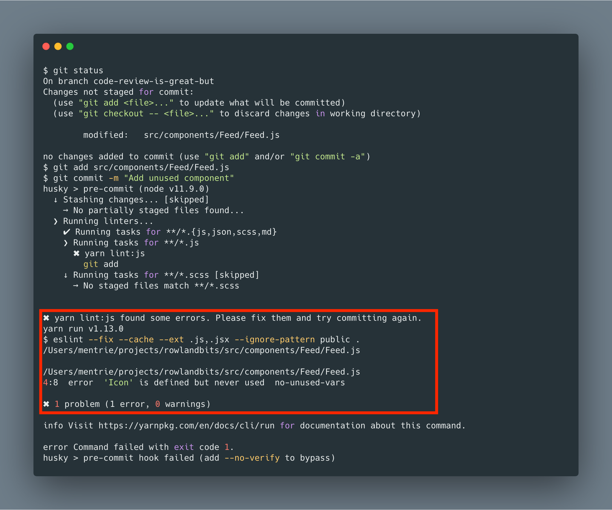

<i>Photo by NESA by Makers on Unsplash</i>

Quality software development requires an efficient process for code reviews. Tech teams spend about ~15% of their time doing code reviews and handling the resultant effect. Sometimes, authors of these pull requests go defensive with review comments which don't end great. It's a great culture for the tech team to prioritize code review but not everything falls under the category of code review!

Over the last 1 year, I've spent the bulk of my time reviewing code considering my position and numerous clients we work with. I've learnt quite a few lessons because ~15% of my time is spent on code reviews and resolving the follow-up discussions.

## How important is code review?

Lot's of articles out there about the benefits of code review. I'd try to summarize a few of them from my personal experience before I address the main focus of this article.

#### Simplicity and maintainability

Functional software is still not perfect. Someday and somehow, the code will need to be improved.

<blockquote>Good code is simple. Code reviews are a great way to train teams to write simple code. Don&#39;t be afraid to say &quot;this is hard to understand&quot;.</p>&mdash; Eric Elliott (@_ericelliott) <a href="https://twitter.com/_ericelliott/status/1117217162844884992?ref_src=twsrc%5Etfw">April 14, 2019</a></blockquote>

#### Knowledge sharing

Code reviews are an opportunity to share knowledge and make informed engineering decisions. During review team members gain a better understanding of the code base and learn from each other which is great. As the Engineering team grows, some team members will start losing context on the project status but code review ensures that everyone has at least a high-level context about the codebase/project. Code reviews mean more eyes on the code and an increased likelihood of exposing mistakes. Code review provides a form of mentorship for your team as well.

<blockquote>Code reviews are best for bug prevention, not bug catching. The magic comes from the knowledge sharing.</p>&mdash; Eric Elliott (@_ericelliott) <a href="https://twitter.com/_ericelliott/status/1113229761453727744?ref_src=twsrc%5Etfw">April 3, 2019</a></blockquote>

#### Team cohesion

Code review improves communication and relationship between team members. It gives insights into different areas of expertise in the team which everyone can leverage. One resultant effect of code review is alignment to the team's goal and the project's big picture.

<center>
 . . . . . . . .
</center>

## Code reviews are great but... 🤔

Code reviews are great with tons of benefits but time wasted on some issues could have been resolved upfront with a better process.

Let's go over a few of them...

#### Maintain agreed team's guidelines

The argument about style during code review is a waste of time. The debate over spaces, tabs, spaces, formatting, naming convention, and curly braces is a misplaced priority. Maintain a style guide and you won't need to debate over them during code reviews. There're lots of existing style guide out there. Your team can [adopt them](https://google.github.io/styleguide/) or create your own guide incrementally and host on platforms like [Github pages](https://pages.github.com/).

#### Write technical specification

Every feature/bug/refactor comes with its own challenges and lots options as well. Like most things in life, opinions are subjective and when you're working in a team, it's crucial to have a decent technical specification on how to solve the problem before coding. Most teams are already doing great with product specification/requirement. However, teams should have a process to write, review, and approve technical specification before development.

A technical specification is both documentation and a detailed technical approach. This in itself helps to avoid unnecessary discussion over a pull request. It serves as a technical reference. This shortens development time as time wasting is reduced drastically. Writing technical specification allows the author to critically think about the approach to meet the product requirement. With decent technical specification, another team member and probably a junior developer in the team can still write decent code.

#### Integrate code formatter

Code formatters allow you to focus on your priority which is definitely functional software and allow it to handle all the nuances with formatting. Since they can be configured, they give you plenty of options. Code formatters like [prettier](https://prettier.io/) is prettier great and supports different languages. All popular text editors and IDEs allow you to install these plugins which would improve your productivity. The code formatter can be integrated as part of your CI workflow so the author ensures these issues are addressed before code review.

A [Circle CI](https://circleci.com/) script to run the formatter could look like this inside _.circleci/config.yml_.

```bash
......
......
- run:
    name: Prettier check
    command: npm run prettier-check
```

#### Set up linting

> Lint, or a linter, is a tool that analyzes source code to flag programming errors, bugs, stylistic errors, and suspicious constructs. - [wikipedia](https://en.wikipedia.org/wiki/Lint_%28software%29).

Linting is the process of [static checking](http://web.mit.edu/6.005/www/fa16/classes/01-static-checking/#static_checking_dynamic_checking_no_checking) your source code source before compilation.

Some of the useful linters are [ESLint](https://eslint.org/), [JSLint](https://github.com/douglascrockford/JSLint), [CSSLint](https://github.com/CSSLint/csslint), [StyleLint](https://stylelint.io/), [Pylint](https://www.pylint.org/).

Also, you can integrate your linting setup to your CI workflow and the author will take ownership of ensuring the build process is all green.

A simple script to run your linting on CircleCI looks like this:

```bash
......
......
- run:
    name: Linter
    command: npm run lint
```

> Linters are not meant to stand in your way. Use what makes you/your team productive.

#### Pre-commit hook

> Git hook scripts are useful for identifying simple issues before submission to code review. We run our hooks on every commit to automatically point out issues in code such as missing semicolons, trailing whitespace, and debug statements. By pointing these issues out before code review, this allows a code reviewer to focus on the architecture of a change while not wasting time with trivial style nitpicks - [pre-commit documentation](https://pre-commit.com/).

Here's a simple implementation with [husky](https://github.com/typicode/husky) and [lint-staged](https://github.com/okonet/lint-staged). It basically runs prettier on the codebase, lint the Javascript files and [SCSS](https://sass-lang.com/) file as well when you commit your changes. It enforces all the rules specified and point you to the right files to fix them if anyone fails.

```json
// package.json
{
 .....
 .....
   "husky": {
    "hooks": {
      "pre-commit": "lint-staged"
    }
  },
  "lint-staged": {
    "**/*.{js,json,scss,md}": [
      "prettier --semi=true --single-quote --write",
      "git add"
    ],
    "**/*.js": [
      "yarn lint:js",
      "git add"
    ],
    "**/*.scss": [
      "yarn lint:scss",
      "git add"
    ]
  }
}
```

Let's run a test...
I imported unused components into a file

```js
.....
import Icon from 'components/Icon'
.....
```

And then I tried committing the changes. _yarn lint:js_ fails with the exact location where the problem is. I can fix it and push again. That's safe, right?



#### Automate visual testing

For pull requests requiring UI changes, the QA process is still done minimally as part of a code review process. However, manual QA is expensive and not scalable. Testing for cross-browser compatibility is a nightmare. Automated visual testing will save you a handful amount of time. I wrote on [improving your visual review with percy](../improve-your-visual-review-with-percy) with a detailed walkthrough on how to integrate it with your existing workflow.

#### Conclusion

Not everything labelled code review falls under that category actually. With a little bit more standard process and automation, your team can focus on the architecture of change without worrying on pretty trivial issues.

#### Further reading

- [Code review best practices](https://medium.com/palantir/code-review-best-practices-19e02780015f)
- [Benefits of code review](https://smartbear.com/learn/code-review/why-review-code/)
