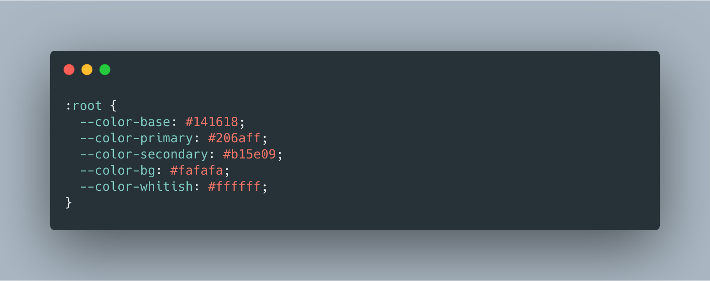
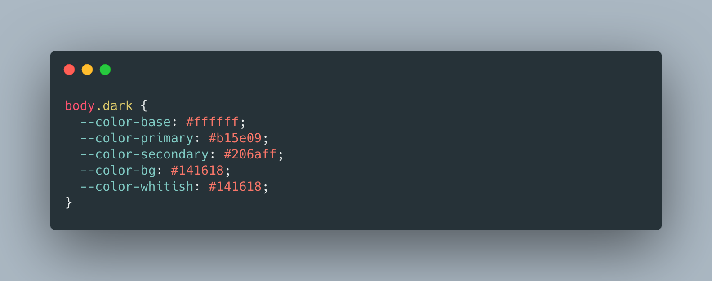
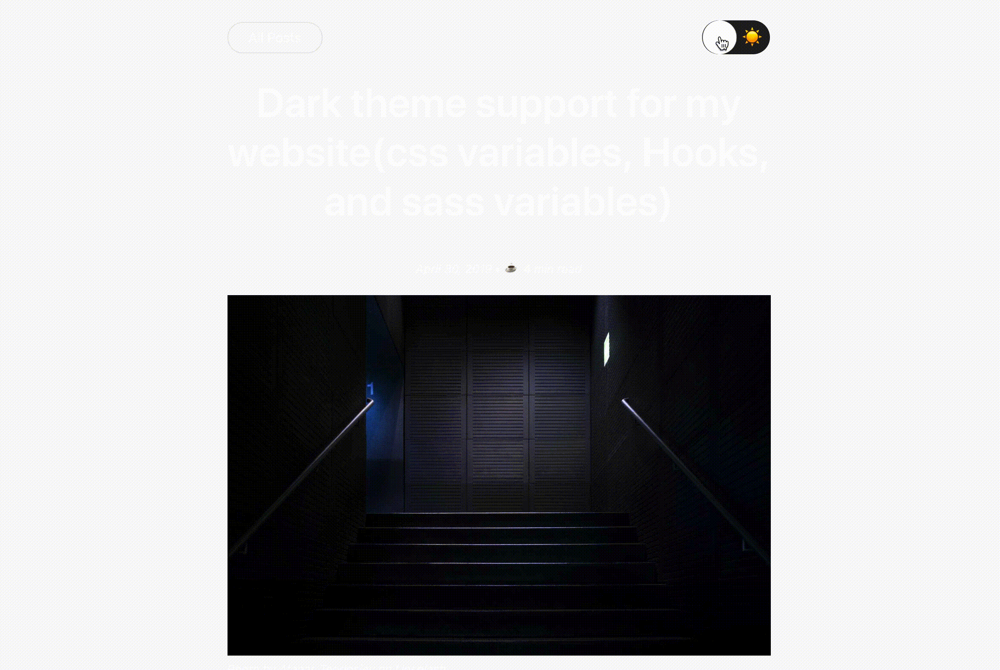
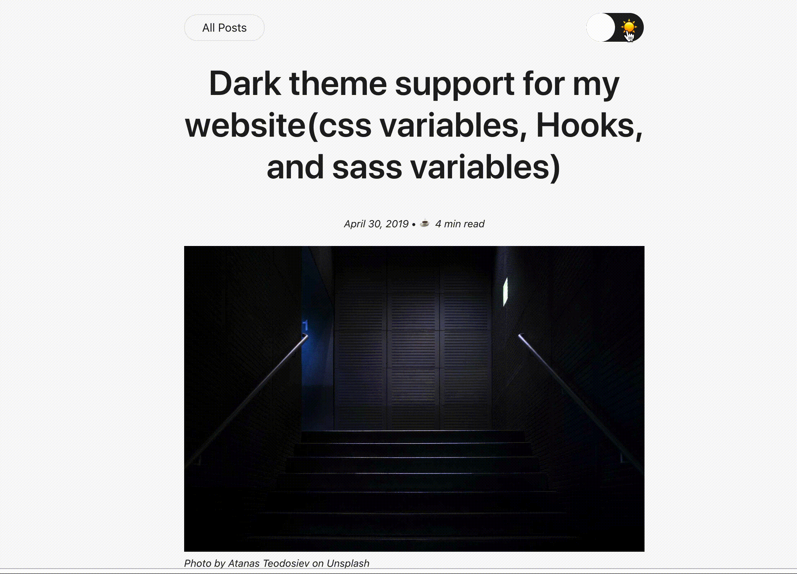

<i>Photo by Atanas Teodosiev on Unsplash</i>

## Introduction

The reason for this post is to highlight the steps I took to add dark theme support and why I took certain decisions. Your mileage will vary so see it as a guide and not the gospel. The [starter kit](https://github.com/alxshelepenok/gatsby-starter-lumen) used to bootstrap this site already made a few decisions which I wouldn't want to change like [SCSS](https://sass-lang.com/) which is pretty great. With a [CSS-In-Js](https://medium.com/dailyjs/what-is-actually-css-in-js-f2f529a2757) library like [styled-components](https://www.styled-components.com/) or [emotion](https://emotion.sh/docs/introduction), few things would have been easier.

## Objectives

- I should be able to share functionality across all components with React hooks
- I should be able to use both Sass and CSS variables together
- I should be able to use either of Sass variables or CSS variables
- User preferred mode should be remembered
- The transition between modes should be smooth

## Use React Hooks for the sharable logics

I needed a shared logic for the ToggleSwitch component. One important reason is that the toggle switch will be used ~3 places and it's a lot cleaner using React hooks for this. The inspiration was gotten from [switching off the lights adding dark mode to your react app with context and hooks](https://medium.com/maxime-heckel/adding-dark-mode-to-your-react-app-with-context-and-hooks-f41da6e07269)

```js
import React, { useState, useEffect, useContext } from 'react';

const ThemeContext = React.createContext({
  isDark: false,
  toggleTheme: () => {}
});

// Can only be used within the ThemeContext provider
const useTheme = () => {
  const context = useContext(ThemeContext);
  if (!context) {
    throw new Error('useTheme must be used within ThemeProvider');
  }
  return context;
};

// A custom hook to add ".dark" class to the the body
//  element if the persisted mode on localStorage is dark.
const useDarkThemeEffect = () => {
  const [themeState, setThemeState] = useState({
    isDark: false,
    hasThemeLoaded: false
  });

  useEffect(() => {
    const lsDark = localStorage.getItem('isDark') === 'true';
    if (lsDark) {
      document.querySelector('body').classList.add('dark');
    }
    setThemeState({
      ...themeState,
      isDark: lsDark,
      hasThemeLoaded: true
    });
  }, []);

  return { themeState, setThemeState };
};

const ThemeProvider = ({ children }) => {
  const { themeState, setThemeState } = useDarkThemeEffect();

  // Render <div /> if the mode is not loaded yet
  // to avoid rendering in light mode by default
  if (!themeState.hasThemeLoaded) return <div />;

  // Add or remove ".dark" class from the body element
  // when a user toggles the switch
  const toggleTheme = () => {
    const isDark = !themeState.isDark;
    localStorage.setItem('isDark', JSON.stringify(isDark));
    const bodyEl = document.querySelector('body');
    isDark ? bodyEl.classList.add('dark') : bodyEl.classList.remove('dark');
    setThemeState({ ...themeState, isDark });
  };

  return (
    <ThemeContext.Provider
      value={{
        isDark: themeState.isDark,
        toggleTheme
      }}
    >
      {children}
    </ThemeContext.Provider>
  );
};

export { ThemeProvider, useTheme };
```

I'm basically using [createContext](https://reactjs.org/docs/context.html#reactcreatecontext) and [useContext](https://reactjs.org/docs/hooks-reference.html#usecontext) to provide access to _isDark_ and _toggleTheme_ function. I just need to wrap the [Layout component](../../../src/components/Layout/Layout.js) with the context provider. Then, with useContext I can access _isDark_ and _toggleTheme_ on every child component. This is pretty much the same way you'd use [Provider](https://react-redux.js.org/api/provider) and [Connect](https://react-redux.js.org/api/connect) functions in [redux](https://redux.js.org/). Also, I'm adding _dark_ CSS class if the mode is dark and also persisting user mode to the localStorage. Finally, we export _ThemeProvider_ and _useTheme_.

Here's how it's used in the [layout component](../../../src/components/Layout/Layout.js)

```js
/* components/Layout/Layout.js */
<ThemeProvider>
  // highlight-line
  <div className={styles['layout']}>/* Rest of the code */</div>
</ThemeProvider>
```

We can now access _isDark_ and _toggleTheme_ anywhere with _useTheme_.

```js
...
import Share from 'components/Share';
import { useTheme } from 'utils/hooks'; // highlight-line
import Comments from './Comments';
....

const Post = ({
  url, post, editLink, timeToRead, twitterHandle
}) => {
  const { tags, title, date } = post.frontmatter;
  const { isDark, toggleTheme } = useTheme(); // highlight-line

  const { html } = post;
  const { tagSlugs } = post.fields;
  return (
    <div className={styles['post']}>
    <div className={styles['post__nav']}> // highlight-start
      <Link className={styles['post__home-button']} to="/">
        <span>All Posts</span>
      </Link>
      <ToggleSwitch isDark={isDark} onChange={toggleTheme} />
    </div> // highlight-end
      ....
      ....
    </div>
  );
};
```

## Add ToggleSwitch component

Next up is to create a simple and beautiful _ToggleSwitch_ component.

```js
import React from 'react';
import styles from './ToggleSwitch.module.scss';

const ToggleSwitch = ({ isDark, onChange }) => (
  <div className={styles['switch']}>
    <input
      type="checkbox"
      id="switch"
      checked={isDark}
      onChange={onChange}
      aria-label="Switch between Dark and Light mode"
    />
    <label htmlFor="switch">
      <span>🌙</span>
      <span>☀️</span>
    </label>
  </div>
);

export default ToggleSwitch;
```

## Combine CSS variables and Sass variables

Sass variables were already used in the [starter kit](https://github.com/alxshelepenok/gatsby-starter-lumen) I bootstrapped the project from. Like I mentioned in the first paragraph, things would have been a little easier with [styled-components](https://github.com/styled-components/styled-components), [emotion](https://github.com/emotion-js/emotion) or any of the [CSS-in-JS library](https://blog.bitsrc.io/9-css-in-js-libraries-you-should-know-in-2018-25afb4025b9b). However, I don't want to change the current structure.

First up, I created a [sass map](https://sass-lang.com/documentation/values/maps#using-maps) of the existing colors to help me convert them to css variables and ensure that nothing depending on them breaks.

```css
$colors: (
  base: #141618,
  primary: #206aff,
  secondary: #b15e09,
  bg: rgb(250, 250, 250),
  whitish: #ffffff /* Funny name though 😅 */
);

$colors-dark: (
  base: map-get($colors, whitish),
  primary: map-get($colors, secondary),
  secondary: map-get($colors, primary),
  bg: map-get($colors, base),
  whitish: map-get($colors, base)
);
```

_color-dark_ map simply inverts the colors. I'm using sass [map-get](https://sass-lang.com/documentation/values/maps#using-maps) to access the values specified in the map.

```css
/* Sample usage */
.subscribe {
  color: map-get($colors, whitish); -> #ffffff
}
```

### Convert Sass color map to CSS variables

To achieve the goal of inverting between two color maps, I leveraged the [root css pseudo class](https://developer.mozilla.org/en-US/docs/Web/CSS/:root) inside [\_generic.scss](../../../src/assets/scss/base/_generic.scss) file.

```css
/* For light mode */
:root {
  @each $name, $color in $colors {
    --color-#{$name}: #{$color};
  }
}

/* For dark mode */
body.dark {
  @each $name, $color in $colors-dark {
    --color-#{$name}: #{$color};
  }
}
```

This will transpile to:

  
 

### Create a Sass function for easy accessibility

In order to easily use the CSS variables with the existing styles, I created a sass function which takes the color name and returns a CSS variable.

```js

@function getColor($color-name) {
  @return var(--color-#{$color-name});
}

```

Sample usage looks like this

```css
@import 'path/to/functions.scss' .....
  /* Switch between "#206aff" and "#b15e09" */ color: getColor(primary);

/* Switch between "#141618" and "#ffffff" */
border: 1px solid getColor(base);
```

### Where I didn't use CSS variables

I wanted to have control over which section of the UI is updated with the toggle and which part remains constant. For instance, _Subscribe to Newsletter form_, _code blocks_, _scroll to top button_, _Footer_, etc should remain as-is. In those cases, I accessed the color from the map instead of using the values set in the CSS variables.

```css
/* Subscribe form */
.subscribe {
  /*
    The color and background remains constant
    when you change mode
  */
  color: map-get($colors, whitish); // highlight-line
  max-width: 350px;
  background: map-get($colors, primary); // highlight-line

  ....
  ....

```

### Color updates not syncing properly

The color of some sections of the page content was updating faster than others. This is obviously a bad UX as different sections update differently. A workaround was adding color to the content wrapper CSS class, [".content"](../../../src/components/Post/Content/Content.module.scss).

```css
/* components/Post/Content/Content.module.scss */

.content {
  max-width: $layout-post-single-width;
  padding: 0 15px;
  margin: 0 auto;
  color: getColor(base); // highlight-line
  ..... .....;
}
```

.

|                  Before fix                  |                     After fix                     |
| :------------------------------------------: | :-----------------------------------------------: |
|  |  |

## Dark mode coming to CSS!

With the introduction of dark mode in macOS, Safari Technology Preview 68 has released a new feature called prefers-color-scheme which lets us detect whether the user has dark mode enabled with a media query.

Mark Otto described [how we can start using prefers-color-scheme](http://markdotto.com/2018/11/05/css-dark-mode/) today in order to create themes that dynamically adjust to the new user setting.

```css{7-13}
/* _generic.scss */
:root {
  @each $name, $color in $colors {
    --color-#{$name}: #{$color};
  }
}
@media (prefers-color-scheme: dark) {
  :root {
    @each $name, $color in $colors-dark {
      --color-#{$name}: #{$color};
    }
  }
}
```

## Conclusion

There's an obviously good reason to add dark mode support to the modern day applications. However, such support might be daunting for a legacy codebase. I hope you were able to pick up a few ideas from this article and the lessons learnt.
