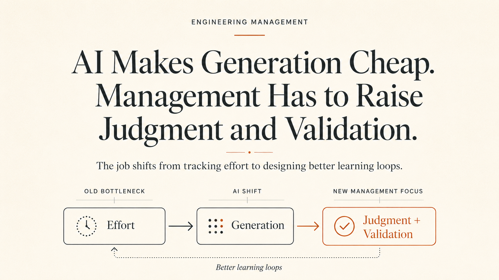

Most conversations about AI and engineering get trapped in code generation. I believe that framing feels a bit naive.

The deeper shift is economic: Arguably, AI lowers the cost of producing engineering artifacts. Code is only one of them. Tests, documentation, design sketches, incident summaries, log analysis, migration plans, architecture alternatives, support investigation, prototypes, and review notes all start getting cheaper to produce.

Software engineering is broadly the work of turning ambiguity into reliable systems while navigating product constraints, operational risk, technical debt, team coordination, and business pressure. AI now touches more of that surface area, which means the manager's job starts moving away from tracking effort and closer to managing judgment, validation, and learning.

The shift happening now is worth paying attention to.

## The Old Bottleneck Was Effort

For years, the default Engineering Manager model was built around one obvious constraint: engineering work was expensive.

If you wanted more output, you usually probably needed more people, more time, clearer requirements, fewer blockers, better prioritization, and tighter execution. A lot of management practice grew around that reality.

So we measured delivery dates, sprint predictability, throughput, utilization, velocity, ticket completion, and roadmap progress. None of those measures were perfect, but they mostly made sense in a world where human effort was the scarce resource.

AI is pushing that assumption to the limit.

A controlled GitHub Copilot study found developers completed a programming task **55.8% faster** with Copilot than without it. McKinsey estimated generative AI could improve software engineering productivity by **20-45% of current annual spending**, across work such as code generation, refactoring, root-cause analysis, and system design. Stack Overflow's 2025 survey also shows AI has moved into mainstream developer workflows, with **84%** of respondents using or planning to use AI tools and **51%** of professional developers using them daily. ([GitHub / Microsoft Research][1], [McKinsey][2], [Stack Overflow][3])

So yes, AI can increase speed. But speed and progress are not the same thing.

The gap between speed and progress is where I think the management problem begins.

## The New Bottleneck Is Validation

A simple way to reason about the shift:

> **Output = Judgment x Systems x AI Throughput**

Judgment covers problem selection, taste, prioritization, tradeoffs, and knowing what to avoid.

Systems include the workflows, architecture, tooling, validation layers, feedback loops, and operating habits that turn decisions into dependable outcomes.

AI throughput is the team's ability to generate useful artifacts quickly: code, tests, docs, analysis, diagrams, prototypes, migration plans, reviews, and summaries.

For years, throughput was expensive. You waited for people to produce things. AI reduces that cost, which moves the pressure somewhere else.

The more important constraint becomes:

> **Effective Output = min(Judgment x Systems x AI Throughput, Validation Capacity)**

I think this is where many teams will feel the pain. A team can generate more than it can understand, review, test, operate, or safely roll back. At that point, AI does not create leverage; it creates a growing pile of unverified decisions because it's difficult to outsource understanding.

I view this as the **generation-validation gap**.

It may become the central management problem of the AI-assisted engineering organization.

## Individual Productivity Can Rise While System Quality Becomes Unstable

The data gets interesting here, but also concerning.

The 2024 DORA research complicated the simple productivity story: AI adoption was associated with higher individual productivity, flow, job satisfaction, and documentation quality, while also showing negative associations with software delivery throughput and stability. The 2025 DORA report appears more optimistic on throughput and product performance, which _suggests_ teams are learning how to integrate AI better, but the instability concern has not disappeared. Google's 2025 DORA summary says AI adoption now has a positive relationship with delivery throughput and product performance, while other summaries of the same report still highlight the tradeoff: faster delivery can come with more instability, rework, and change failures. ([DORA 2025][4], [Google Cloud][5])

The insights uncovered by this research should make every Engineering Manager/Leader pause.

Both ideas can be true at once: engineers may feel faster, while the system becomes harder to reason about.

A team can create more pull requests, more documents, more tests, more prototypes, more dashboards, and more plans. But if judgment does not improve, and the system cannot validate the output, the organization does not get better engineering.

Simply put, it gets more artifacts, but generally speaking, artifact volume is a weak proxy for productivity.

## The EM Role Moves Upstream

The old EM question was often: how do we help the team ship faster?

The AI-era version is more uncomfortable: where does speed create new failure modes?

An EM now has to care less about whether work is merely moving and more about whether the system is learning the right things, making better decisions, and reducing risk as it moves.

The questions have entered the conversation.

Are we solving the right problem? Are we generating useful options or generating noise? Do we understand the constraints? Which parts of this change are reversible? What needs human review? What can be validated automatically? Where could this fail silently? Do we know what _correct_ means before asking AI to help us move faster?

We will see weak management getting exposed here. A team with poor judgment does not become excellent because it gets AI. It becomes faster at producing consequences.

## Code Review Is Too Narrow a Lens

A lot of the AI conversation gets trapped in code review. A much more broader shift might be system review.

In an AI-assisted workflow, an engineer may generate a design sketch, migration script, test coverage, rollout plan, documentation, and incident checklist in the same afternoon. The code may look fine. The pull request may look reasonable. The tests may even pass with good coverage.

The deeper question is whether the whole change is coherent.

Does the design match the product intent? Do the tests prove the behavior we care about? Does the rollout match the blast radius? Can we observe failure quickly? Can we roll back safely? Does anyone deeply understand the edge cases?

This is where I think Engineering Managers need to raise the bar. AI makes local output easier, but global correctness still has to be designed.

## Process Has to Become Less Ceremonial and More Diagnostic

I do not buy the lazy version of this argument: "Agile is dead" or "sprints are useless." That sounds dismissive, but it avoids the real issue.

A much better point is that many planning systems were designed around a slower production model.

When work becomes more exploratory, generative, and iterative, the process has to adapt. Otherwise, teams end up with a strange mismatch: AI-speed artifact generation inside old-world planning rituals. It's akin to pouring new wine into an old wine skin.

Tickets may move, standups happen, velocity gets reported, roadmaps get adjusted, and dashboards look busy. But nobody can confidently say whether the team is making better decisions.

The AI-era EM has to redesign workflow around faster learning loops, not just faster completion.

This might feel like a different job, but I think it's just an evolution of the way we manage teams.

## Hiring and Performance Get Harder

AI complicates talent judgment.

Hard skills would and still matter. Fundamentals still matter. Taste matters more than ever. But the signal changes.

A person who can use AI to explore, compare, validate, and communicate tradeoffs may outperform someone with stronger static knowledge but slower learning loops. That does not mean average engineers suddenly beat senior engineers. It means seniority has to prove itself differently.

The question becomes less about what someone knows in isolation and more about how quickly they can reason through a messy problem, use tools well, validate assumptions, and improve the system around them.

My experience talking with Engineering leaders is that it is harder to evaluate.

It also means performance systems based mostly on visible effort will become more misleading. AI somewhat makes effort a weak proxy for impact.

## The Real Risk Is Productivity Theater

This is the trap many companies will fall into.

They will adopt AI tools and measure the easiest things: more pull requests, more tickets closed, more code generated, more documentation produced, shorter cycle time in isolated workflows, even more tokens burned.

Some of that will be useful. None of it will be enough.

A serious measurement system has to ask whether customer value improved, whether change failure rate went up or down, whether operational load decreased, whether maintenance burden improved, whether onboarding got easier, whether incidents became clearer, and whether teams are learning faster.

Otherwise, AI adoption becomes another form of productivity theater with lots of motion, but weak signal.

## So What Is the New EM Job?

The new EM job is not prompt engineering, tool chasing, or pressuring engineers to generate more.

The job is managing the relationship between generation, judgment, validation, and learning.

That means building teams that can move faster without becoming careless. It means designing workflows where AI improves exploration without bypassing responsibility. It means creating systems where more output leads to more understanding, not more noise.

The EM becomes less of a delivery tracker and more of a system designer in the practical sense of it.

How does work enter the team? How are options explored? How are assumptions tested? How are decisions reviewed? How are failures detected? How does learning get fed back into the system?

That is management in the AI-assisted engineering organization.

## Bottom Line

The code-generation debate sits on the surface.

The deeper shift is that AI makes generation cheaper across the engineering lifecycle. When that happens, effort loses its place as the main bottleneck. Judgment, validation, context, taste, and trust become more important.

Engineering Managers were trained in a world where effort was scarce. Let's just say that world is fading.

The next generation of EMs will be judged by a different standard: whether they can build teams and systems where humans and AI make better decisions, validate those decisions faster, and learn without making the organization more fragile.

Managing more output won't be the new norm. Managing better outcomes will be.

## References

- [DORA / Google Cloud - State of AI-assisted Software Development 2025][4]
- [Google Cloud - Announcing the 2025 DORA Report][5]
- [GitHub / Microsoft Research - The Impact of AI on Developer Productivity: Evidence from GitHub Copilot][1]
- [McKinsey - The Economic Potential of Generative AI][2]
- [Stack Overflow - 2025 Developer Survey: AI][3]

[1]: https://arxiv.org/abs/2302.06590
[2]: https://www.mckinsey.com/capabilities/quantumblack/our-insights/the-economic-potential-of-generative-ai-the-next-productivity-frontier
[3]: https://survey.stackoverflow.co/2025/ai
[4]: https://dora.dev/dora-report-2025/
[5]: https://cloud.google.com/blog/products/devops-sre/announcing-the-2025-dora-report
