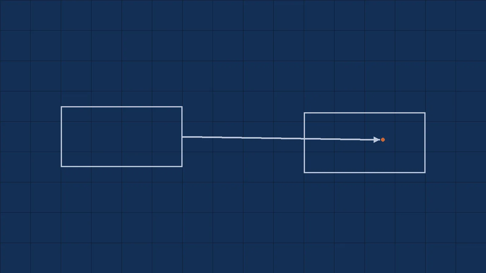

[In the first article of this series,](https://rowlandekemezie.com/posts/integrations-start-where-api-documentation-ends/) I argued that integrations begin at the point where API documentation ends. Once your product depends on a third‑party system, the work becomes less about making API calls and more about owning the boundary between your domain and theirs. This second installment expands on that idea. It is about what happens when external systems quietly diverge from the world your code believes in.

Most integration failures do not start with a pager duty alert or a provider outage. They begin when a customer notices that something they know to be true doesn’t align with what your application shows. The API still responds; the queue still drains; the dashboards all glow green. Yet something fundamental has shifted. Engineers often describe these moments by saying _external systems lie_. The reality is more interesting. External systems are not dishonest; they are simply evolving in ways your code is no longer prepared to accept.

## The payment that moved backwards

During a payroll integration project, we assumed a transaction's lifecycle looked like this:

1. A payment starts as **pending**.
2. It transitions to **processing**.
3. It ends in **completed**.

For months every payment followed that sequence. Product teams built workflows around it. Support teams learned how to explain it. Engineers began treating it as a natural law. Then, on an otherwise ordinary morning, several completed payments suddenly became processing again. Nobody had deployed anything. There was no incident in the provider’s status page. Everything looked healthy. Our integration had simply promoted an observation (payments usually move forward) into an invariant (payments can **never** move backwards).

The root cause turned out to be a provider‑side reconciliation job that revisited transactions under specific conditions. The provider considered this “correction” harmless; our system considered it impossible. This was the first lesson: be careful when you allow runtime behaviour to harden into an invariant. External systems will eventually violate assumptions that looked obvious for months.

## Documentation is often a historical artifact

Engineers love documentation. We depend on it to understand how a provider's API intends to behave. Unfortunately, documentation often reflects what a provider intended, not what it actually does.

I have seen integrations run flawlessly until a provider added fields or changed existing ones. Consider this payload:

```json
{
  "id": "txn_123",
  "status": "completed",
  "amount": 1200
}
```

For a long time the integration consumed this payload and everything behaved. Then, without any visible announcement, the provider evolved its model:

```json
{
  "id": "txn_123",
  "state": "completed",
  "amount": "1200.00",
  "currency": "USD"
}
```

From their perspective, the change was additive and backwards compatible: they renamed a field, changed a numeric value to a string, and added a currency. From our perspective, several assumptions became invalid simultaneously. Some services expected a field called `status`. Others assumed `amount` was numeric. A reconciliation process quietly began producing incorrect results because these assumptions had never been revisited.

Documentation had not changed. Reality had. The second lesson is that runtime behavior often evolves faster than any published schema. Treat documentation as a starting point, not as a guarantee.

## The new enum value that broke everything

Another integration moved work items from an external tracking system into our database. We knew that each item existed in one of four states: `open`, `in_progress`, `blocked`, or `closed`. Our TypeScript types reflected those possibilities, and the code assumed that if a provider returned anything else we would throw an error. Months later, the integration began failing in production. It starts off with a few records, not everywhere and not all at once. The root cause? The provider had introduced a new status called `review`.

From their perspective, this was a simple extension. From ours, the world no longer matched the type definitions in our code. This is the kind of drift Martin Fowler warns about in his description of the `tolerant reader pattern`. He notes that coupling your code too tightly to a schema makes any additive change feel like a breaking change. The better approach is to “be liberal in what you accept”. Read the fields you need, ignore what you don’t, and make as few structural assumptions as possible. A tolerant reader allows a provider to evolve without automatically breaking consumers.

In practice, this means treating external payloads as untrusted. Instead of binding directly to a generated SDK type, parse the payload into a value object that validates required fields and coerces values into your domain. Unknown fields should be passed through or discarded harmlessly. Required fields should be validated. Unexpected values should be rejected loudly. The third lesson is that small additions like a new enum value are inevitable; build for them.

## Static types are not trust boundaries

Modern languages make it tempting to believe that static type safety ensures correctness. Types do prevent entire classes of bugs, but they do not protect you from reality. Consider a payment provider that returned the following payload for years:

```json
{
  "amount": 1200
}
```

One day the provider decided that all monetary values must be represented consistently as strings. The new payload looked like this:

```json
{
  "amount": "1200.00"
}
```

Nothing broke at compile time. The SDK generated from the provider’s OpenAPI specification continued to compile. The application deployed. Yet deep inside a reporting pipeline, numbers started concatenating as strings and producing corrupted totals. The bug went unnoticed for weeks because the compiler remained happy.

Runtime validation is what protects you from the world outside your type system. A generated SDK can only reflect the provider’s schema when it was generated. If the provider changes behaviour between versions, the types become a fossilised belief. The tolerant reader pattern encourages consumers to assume as little as possible. Postel’s law “be liberal in what you accept” is often quoted in this context. In practice, it means validating and coercing external payloads at runtime, not trusting that your types will remain accurate. The fourth lesson is that static types describe your beliefs; runtime validation protects you from change.

## Eventual consistency makes systems look broken

One of the most frustrating support calls I’ve handled involved an invoice that was created successfully but could not be found in search. A customer created an invoice, received a success response, and then immediately attempted to search for it. The search returned nothing. They opened a support ticket and understandably asked if our system was broken. We checked our logs: the invoice existed. The search index had not yet updated. The provider’s architecture exposed the write through an API and the search through an eventually consistent index.

Engineers talk about eventual consistency as though it is abstract, but the pattern shows up in mundane ways. ScyllaDB’s glossary defines eventual consistency as a guarantee that when an update is made in a distributed system, “that update will eventually be reflected in all nodes”. In other words, every replica converges to the same state over time, but there is no guarantee about when. This is why your code cannot assume that a successful write means every downstream system has observed the change.

A mature integration accommodates this by designing workflows around convergence. After creating an invoice, the system may wait for a confirmation event before making the record visible. Reports may read from a snapshot that is guaranteed to be at least as recent as the last reconciliation run. Retries should be scheduled intelligently rather than hammered until the state aligns. The fifth lesson is that the appearance of staleness often reflects eventual consistency rather than failure.

## The provider said nothing changed

A common conversation goes like this: your system is broken; the provider insists nothing has changed. The truth is that both statements can be correct. The provider measures change by whether their published contract has a new version. You measure change by whether your assumptions still hold.

One way to make these invisible assumptions concrete is _consumer‑driven contract testing_. PactFlow describes consumer‑driven contract testing as a process that checks whether a provider is compatible with the expectations that the consumer has of it. The consumer serialises its expectations into a contract file as part of its tests; the provider then verifies that contract as part of its build. If the provider adds a new field that doesn’t affect the contract, nothing breaks. If the provider changes a field in a way that violates the consumer’s contract, the provider’s test suite fails before the change reaches production.

In practice, you can start small: define the HTTP requests your system actually makes and the responses it requires. Use a tool like Pact to record those expectations. Add a step to the provider’s pipeline to verify the contract. When the provider says nothing changed, you’ll have a suite of tests that proves whether that is true. The sixth lesson is that making implicit assumptions explicit reduces the number of “he said, she said” incidents.

## Reconciliation: the four missing records

The longer an integration runs, the more important reconciliation becomes. Synchronisation answers _How do we move data_? Reconciliation answers _Is the data still correct?_ During a payroll integration we ran a nightly reconciliation job that compared the number of records in our database with the number of records in the provider’s system. One morning the job produced this summary:

```text
Local Records: 102,341
Provider Records: 102,337
Difference: 4
```

Four records were missing. Which system was wrong? Did records vanish? Did a previous synchronisation fail quietly? Did the provider backdate a termination? Without reconciliation you only learn about divergence when a customer complains. With reconciliation you catch drift before it becomes an incident. The seventh lesson is that integration systems need accounting practices: raw events, normalised records, and periodic comparisons.

## Production systems trust slowly

Junior systems trust responses. Mature systems verify them. After enough incidents, experienced engineers stop treating external payloads as gospel. They design boundaries that validate inputs, tolerate additions, and detect divergence. They assume external systems will evolve independently. They recognise that provider documentation is often a historical artifact. They build reconciliation jobs, ingest raw events, and keep provider quirks in code rather than in one engineer’s head.

External systems do not lie because anyone intends to deceive. They lie because two independently evolving distributed systems cannot remain perfectly aligned indefinitely. The goal of integration architecture is not to prevent change. It is to build a system that continues to operate _when_ assumptions become outdated.

## Further reading

- [Tolerant Reader Pattern](https://martinfowler.com/bliki/TolerantReader.html) - Martin Fowler recommends being liberal in what you accept and warns against tightly coupling to a schema.
- [What is Eventual Consistency?](https://www.scylladb.com/glossary/eventual-consistency/) - ScyllaDB's glossary defines eventual consistency and explains how updates propagate through distributed systems.
- [What is Consumer-Driven Contract Testing?](https://pactflow.io/what-is-consumer-driven-contract-testing/) - PactFlow describes how consumer expectations can be captured and verified by providers.
