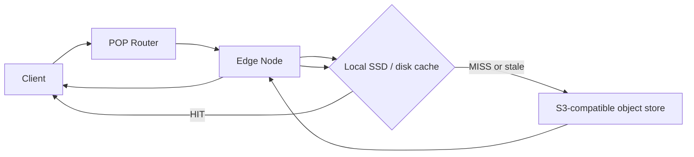
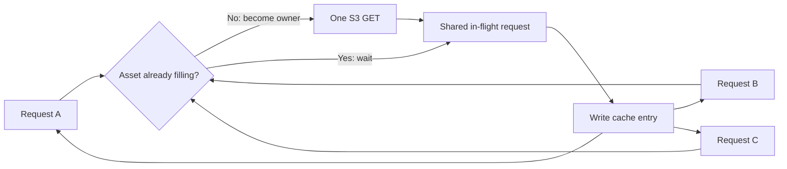
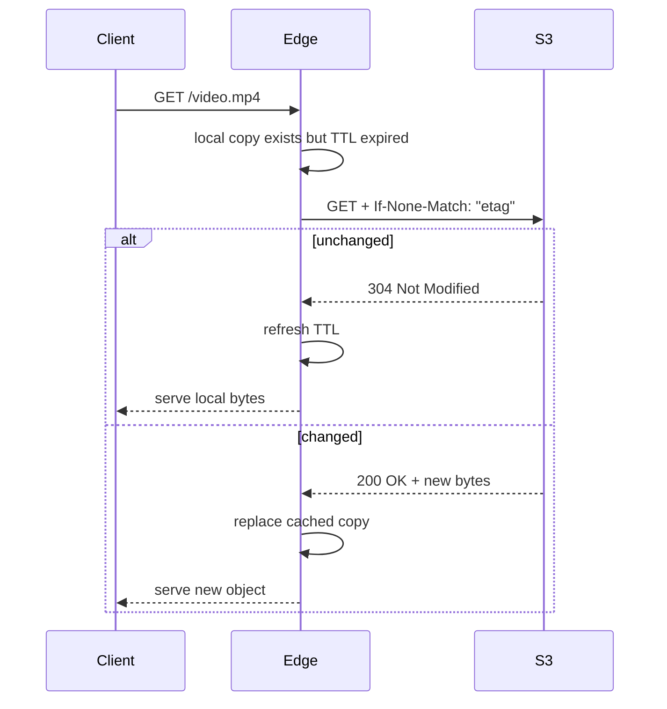
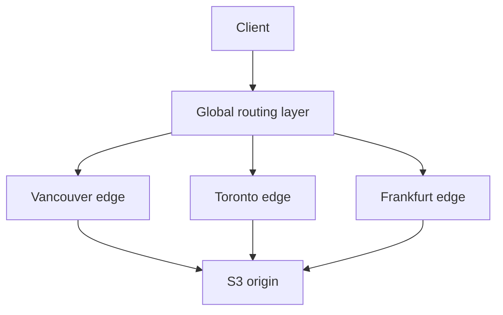

I have been reading more systems that treat object storage as the durable layer and use faster local storage only when data becomes active. Turbopuffer is an interesting example because its durable state lives in object storage while NVMe and memory are used as faster cache tiers for the data being queried.

That got me thinking about a simpler problem. If S3 is already durable, relatively cheap, and available almost everywhere, how much work would it take to put a small CDN in front of it?

I was not trying to build a Cloudflare replacement. I wanted something small enough that I could read the whole path from an HTTP request to the cache and then to S3 without hiding the interesting parts behind a managed service.

I ended up building `object-edge`, a small TypeScript experiment with S3-compatible storage as the source of truth and separate local caches for each edge node.

## The basic shape

The router chooses an edge node. The edge checks its local cache. A fresh object is served locally. A missing or stale object goes back to S3.

The useful part of this design is that the edge owns no durable state. If I delete the Vancouver cache, nothing important is lost. The next request simply fills it again from the object store.

For the local demo, I run three logical POPs: Vancouver, Toronto, and Frankfurt. They all read from the same object store, but each one has a separate disk cache.

That distinction matters because a cache is only useful when it is close to the client asking for the data. Sharing one cache between all three locations would make the demo simpler, but it would also hide one of the main things a CDN is trying to achieve.

## A cache miss is more interesting than it looks

The first version of a caching proxy is easy to imagine: check local disk, fetch from S3 on a miss, save it locally, then return it.

The problem appears when a cold object suddenly becomes popular. If 100 requests arrive before the first S3 request finishes, a naive implementation can send 100 identical reads to S3.

That works, but it is exactly the kind of behaviour a cache should prevent.

So each edge keeps a small in-memory map of object keys that are currently being filled. The first request owns the origin read. Requests that arrive behind it wait for the same fill instead of starting another one.

I added an integration test that sends 12 simultaneous requests to an empty edge cache. All 12 clients receive the object, but the fake origin records one read.

This is usually called request collapsing or request coalescing. The name is less important than the behaviour: concurrent misses for the same object should not become concurrent origin requests for the same bytes.

## Freshness comes from HTTP

Caching the object is only half of the problem. The edge also needs to know when the cached copy can still be trusted.

The edge follows the object's `Cache-Control` header and stores its ETag. When the TTL expires, it asks the origin whether the object changed by sending `If-None-Match`.

The useful part here is that an expired cache entry does not always require downloading the object again. If the ETag is still current, S3 can return `304 Not Modified`, and the edge extends the lifetime of the local copy.

The project also supports byte-range responses once an object is cached. That matters for larger media files and resumable downloads because a client may only need a section of the object instead of the entire file.

## I also removed the AWS SDK from the runtime path

I could have used the AWS SDK for the S3 client, but I wanted the request path to stay small enough to understand directly.

The S3 adapter therefore signs GET requests with AWS Signature Version 4 using Node's built-in crypto APIs. AWS publishes a known GET Object signing example, so the implementation is tested against that reference vector rather than relying only on a test that I wrote myself.

That does not make avoiding the SDK universally better. For a production application, the SDK handles a lot of details that you probably do not want to own. In this project, owning the signing code was useful because the purpose was to understand the path rather than hide it.

## One cache server is not a CDN

This was one of the useful boundaries to make explicit while building the project.

A caching proxy in front of S3 is not automatically a CDN. The distribution part still matters.

The local demo has a small router that chooses Vancouver, Toronto, or Frankfurt using a request header. That gives me separate cache behaviour for multiple POPs, but it does not create a real global network.

In a production CDN, the routing decision normally comes from infrastructure such as Anycast, latency-aware DNS, or another global traffic-management layer that directs a client toward an appropriate edge location.

That is where the project deliberately stops. I wanted the data path to be real while keeping the global network itself simulated.

## What I deliberately did not solve

Once the basic cache worked, the list of missing pieces became a better lesson than adding more code immediately.

There is no distributed purge yet. There is no bounded cache eviction, TLS automation, origin shielding, DDoS protection, multi-tenant isolation, or serious observability. The demo also does not try to solve real geographic routing.

The current cold path has another important limitation. It completes the cache fill before serving the object from disk. That means the first request pays for the full origin download before it starts receiving the cached response.

A better version would stream bytes to the client and a temporary cache file at the same time, then atomically publish the cache entry when the origin stream finishes.

That flow would look closer to this:

This is probably the next iteration because it changes the behaviour of the cold path in a meaningful way rather than just adding another feature.

## Where Turbopuffer fits

The original thought was whether I could build this on top of Turbopuffer. After looking more closely, I do not think that is the right abstraction.

Turbopuffer is a search system. Its object-storage architecture is interesting because it separates durable storage from faster local tiers, but it is already solving a different problem.

What I would consider later is using it beside the CDN rather than underneath it. S3 would continue to hold the bytes while Turbopuffer could index asset metadata, descriptions, embeddings, or other information that makes the assets searchable.

For now, the useful experiment is much smaller: durable objects in S3, disposable caches at the edge, and enough code around them to see what actually happens between a cache miss and a cache hit.

That turned out to be enough to make several CDN concepts that I understood in theory much more concrete. The cache itself is not especially mysterious. The harder problems begin when you have to decide what can be trusted, what should be shared, what must remain local, what happens during a burst, and how all of those decisions change once there is more than one edge.