<i>Photo by Ken Treloar on Unsplash</i>

### The problem
Your development team delivers lots of changes to client facing application to your users. For the most part,  developers don't know when they've broken anything on the UI. You ship UI changes with less confidence not knowing if something was broken. Whereas, there's descent code review + manual QA + test coverage, they ain't enough to catch UI bugs with the number of PRs being shipped to your users. At this point, it's either you engage more manual QA personnel or find a way scalable way of integrating automated visual reviews with immediate feedback cycle both for the author and reviewer before shipping to your users. 

### There're a few reasons for visual reviews:
- Manual QA is not scalable
- Visual regression testing is a life saver
- Automated feedback is a great gain
- Cross browser compatibility issues still lives

### Why Percy
I think [percy](https://percy.io/) does a great job on the above issues. It integrates with your existing CI workflow, highlights visual diffs across browsers, screens and snapshots. The icing on the cake is the ability to review and approve this changes. Basically, percy combines visual testings and review platform in one which is pretty cool.

*Note:* As at the time of this writing, percy is free for upto 5k snapshots monthly.

#### Let's walkthrough how to use percy
I'd be integrating this to the s[repository](https://rowlandekemezie.com) that powers my personal website. It's made with [Gatsby](https://gatsbyjs.com) and deployed to [Netlify](https://netlify.com).

So, let's first clone the repository

```bash
git clone https://github.com/rowlandekemezie/rowlandekemezie.com.git
```

### Run percy locally
You can configure percy-cli for testing locally
```bash
$ gem install percy-cli
```

Before we proceed, we'll need a *PERCY_TOKEN* which is *write-only* API key that only has access to create builds, snapshots, and upload resources to this project. So, signup on [percy](https://percy.io) with your github account.

Next, create an organization name, confirmation email and click *start a new project*.

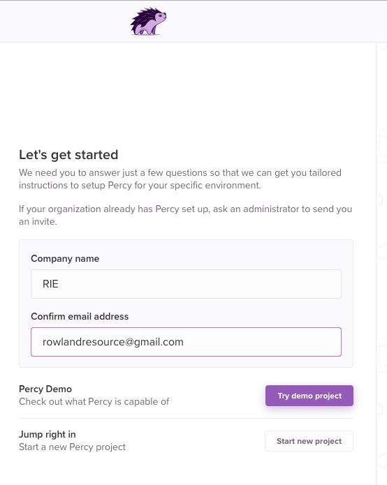

Next up is to add a project to your organization. Probably, a good idea to use the repository name.

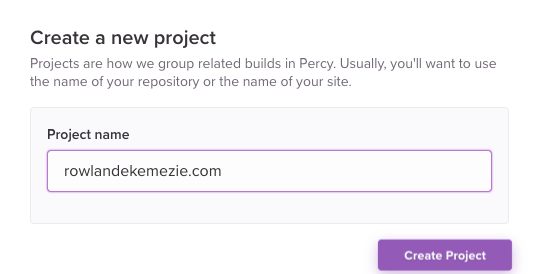

All is set. Now, you have your `PERCY_TOKEN` which will be used for running the test locally and on CI

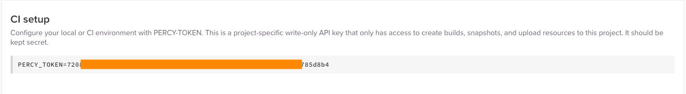

Let's get back to the terminal to test it out locally

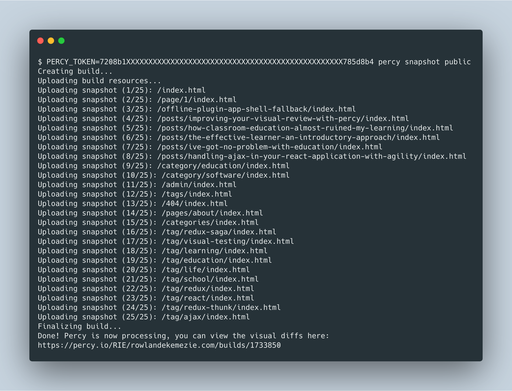
> Ensure you run `yarn build` first.

Click on the link to review it on percy plaftorm

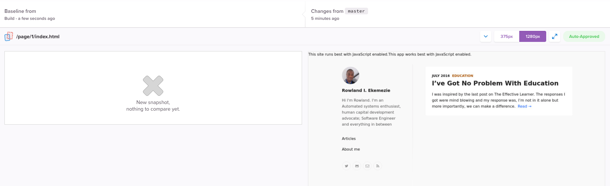

### Integrate with your CI workflow
We'll love to integrate percy to our CI workflow. It should run on every commit

Let's use CircleCI for this. However it works just fine with  every other supported [CI platform](https://docs.percy.io/docs/ci-setup).

First, let's setup the project or CircleCI. login/signup to CircleCI with your github account.

Click on *ADD PROJECTS* to and click on *Setup project* button for the project of choice.

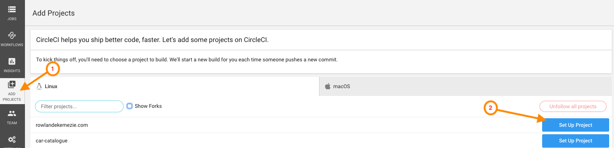

We'll keep the default setting on next page(Linux and Node) and follow other instructions.

Next up, create *.circleci/config.yml* in the wrote directory and populate with

```bash

version: 2

defaults: &defaults
  docker:
    - image: circleci/node:10.15.1
  working_directory: ~/repo

jobs:
  # install: ...

  # lint: ...

  visual:
    - image: circleci/ruby:2.6.2-node-browsers
    working_directory: ~/repo

    steps:
      - checkout
      - run:
          name: install dependencies
          command: |
            yarn install
            gem install percy-cli
      - run: 
          name: Run visual test
          command: |
            yarn build
            percy snapshot public
    
workflows:
  version: 2
  # test: ...
  visual-test:
      jobs:
        - visual
```

> I commented out few some jobs already existing in the project to help us focus on the scope of the this article. When you're done testing, feel free to uncomment them 👌.


Commit and push your code to master. Head over to CircleCI click *Start building*. Hopefully this is successful 👍

The build succeeds but because *PERCY_TOKEN* was not provided, the snapshots won't be pushed to percy.io for our review.

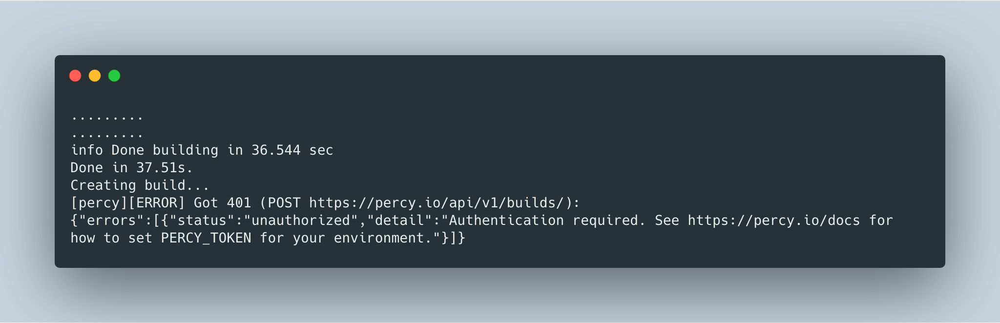

Let's fix it....

Same way we ran percy locally with the _PERCY_TOKEN_, we'll add it to the environment variables. So, click on the settings Icon

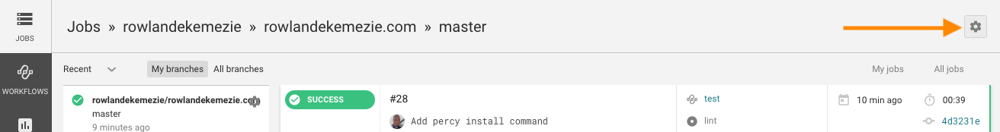

Click on `Environment variables` in the sidebar to add your token

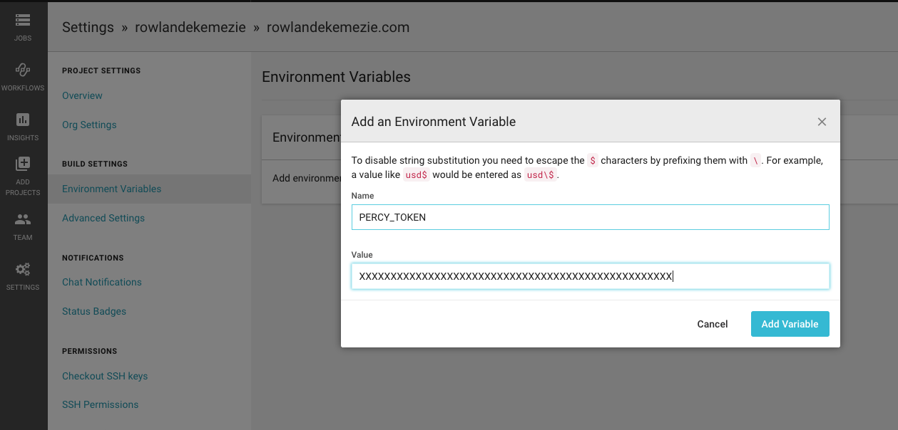.

Commit you changes and push to master again.

Now, we can head to percy.io to see the snapshots created by the build.

### Link up your Percy to your repository
The final part in this setup is to link Percy to our repository to get immediate feedback after each build

In the project setting on percy, click on _install an integration_ and choose *Github*.
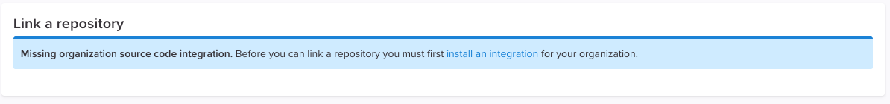

Here you go...
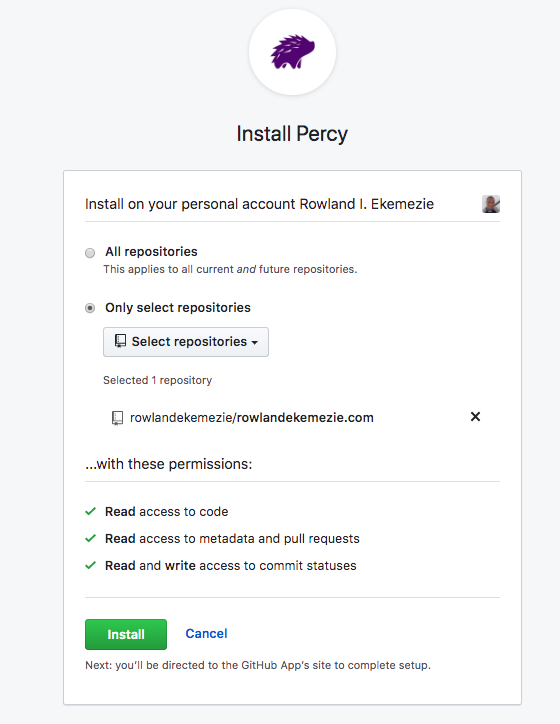

With the source code integration enabled, we can manage our pull/merge request statuses, notifying us when visual changes are detected. It also give a nice interface to approve those changes with the record of who approved the pull request.

Now you can select the repository to link to each project
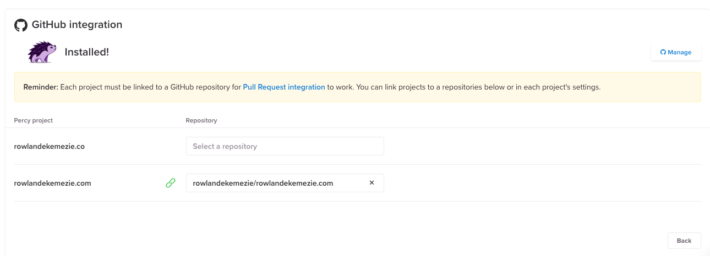

### End to end test
Now, let's test everything together. Let's create a test branch and increase the _font-size_ of the content's title in _/components/Post/Content/Content.module.scss_. Commit the change and create a pull request.

```css
......

.content {

  &__title {
   - font-size: $typographic-base-font-size * 2;
   + font-size: $typographic-base-font-size * 4;
    max-width: $layout-post-width;
    ......
    ......
  }
```


#### Resources
