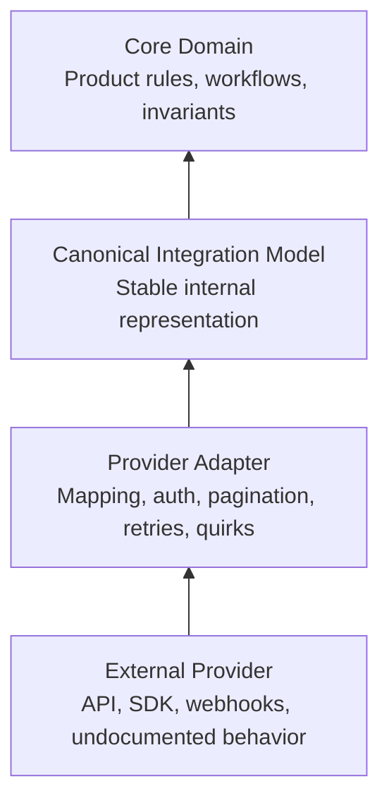

Most integration work looks simple at the beginning because the surface area is intentionally presented as simple.

You install the SDK, generate a token, make the first request, receive a clean JSON response, map a few fields, and for a brief moment it feels like the hard part has already been solved by the provider. But then, production starts.

A webhook arrives before the object it references exists in your local system. A provider sends the same event twice, but with slightly different payloads. A customer changes a setting in the provider dashboard and your assumptions stop being true. A field documented as a number arrives as a string. An API silently starts returning a new status value. A provider says an employee is “active”, but in your product “active” means something more specific. A sync job succeeds from the provider’s point of view, but your local model now contains data your application cannot safely reason about. I believe, this is the point is where real integration engineering begins.

SDK documentation tells you how to call a provider. It rarely tells you how to own the boundary between your system and theirs.

For senior engineers, the work is not only about connecting systems. The deeper work is deciding which system owns which truth, which concepts are allowed to cross the boundary, how external behavior gets translated into internal meaning, and how much of the provider’s worldview you are willing to let into your domain.

Good integrations are rarely thin wrappers around third-party APIs. They become boundary systems.

> Disclaimer: I will be drawing inferences from my own experience working on multi-provider syncing engine and payroll integration systems.

## The mistake is treating the provider as part of your domain

A common integration failure starts with innocent modeling.

The provider has a `User`, so we create a `User`.

The provider has a `Company`, so we create a `Company`.

The provider has a `Status`, so we store the status.

The provider has an SDK, so we pass SDK objects through the application.

At first, this feels efficient. There is less code to write, fewer translation layers, and less architectural ceremony. The team ships faster because the provider’s API shape becomes the application’s integration shape.

The problem comes later, when your product needs to mean something slightly different from what the provider means.

GitHub has repositories, installations, organizations, teams, collaborators, and permissions. Jira has projects, issues, comments, users, transitions, workflows, and custom fields. Payroll systems have employees, contractors, pay schedules, tax jurisdictions, deductions, benefits, earnings, reimbursements, and pay runs. Each provider has a model, but their model exists to serve their product, their constraints, their history, and their commercial decisions.

> Your system needs its own model!

Without that separation, your internal code slowly becomes a museum of provider-specific assumptions.

You start seeing names like this:

```typescript
type GithubUser = {
  id: number;
  login: string;
  avatar_url: string;
  html_url: string;
};
```

Then the type leaks into places where GitHub should not exist.

```typescript
async function assignReviewerToPullRequest(user: GithubUser) {
  await notificationService.notify({
    userId: user.id.toString(),
    displayName: user.login,
    avatarUrl: user.avatar_url
  });
}
```

That looks harmless until the product supports GitLab, Bitbucket, an internal code host, or even a future concept that does not map cleanly to GitHub’s model.

A better internal model starts by asking what the product actually needs to know.

```typescript
type ExternalActor = {
  provider: IntegrationProvider;
  providerActorId: string;
  displayName: string;
  profileUrl: string | null;
  avatarUrl: string | null;
};
```

GitHub can become an `ExternalActor`. GitLab can become an `ExternalActor`. A payroll provider employee, depending on the context, may become a `WorkerIdentity`, `EmploymentRecord`, or `Payee`.

Protect your application from outsourcing its language to someone else’s API. That does not require generic names for everything.

## Integration boundaries need ownership

A mature integration system has a clear boundary.

1. **External Provider**
   API, webhooks, files, SDKs, and all the provider-specific behavior your system does not control.

2. **Provider Adapter**
   Translation, normalization, pagination handling, retries, and provider-specific rules.

3. **Canonical Integration Model**
   The stable internal shape your system uses to reason across providers.

4. **Core Domain**
   Business validation, workflows, and product invariants.

The adapter owns provider behavior.

The canonical integration model owns cross-provider shape.

The core domain owns product meaning.

When those responsibilities are mixed, integration logic becomes difficult to reason about because every part of the system has to understand external quirks. Product services start checking provider names. Background jobs start parsing provider payloads. UI code starts branching on external statuses. Reporting starts depending on raw third-party fields. Tests become fixtures copied from provider responses instead of assertions against your own model.

A clean boundary gives the system one place to absorb external complexity.

For example, imagine a payroll product integrating with several payroll providers. One provider represents a worker like this:

```json
{
  "id": "emp_123",
  "employment_type": "W2",
  "status": "active",
  "home_address": {
    "state": "CA"
  }
}
```

Another provider sends this:

```json
{
  "workerId": 98765,
  "type": "employee",
  "isTerminated": false,
  "taxRegion": "US-CA"
}
```

A weak integration model spreads those differences throughout the codebase. A stronger boundary translates both into something the application can own.

```typescript
type WorkerClassification = 'employee' | 'contractor';

type WorkerLifecycleStatus = 'active' | 'inactive' | 'terminated';

type WorkerRecord = {
  provider: IntegrationProvider;
  providerWorkerId: string;
  classification: WorkerClassification;
  lifecycleStatus: WorkerLifecycleStatus;
  taxRegion: string | null;
};
```

The model is still imperfect because every model is a tradeoff, but the rest of the system now works with concepts it understands.

## The adapter is not only a wrapper

A wrapper forwards calls. An adapter translates meaning.

A wrapper says:

```typescript
async function getEmployee(employeeId: string) {
  return payrollClient.employees.get(employeeId);
}
```

An adapter says:

```typescript
type ProviderEmployeeResponse = {
  id: string;
  employment_type: 'W2' | '1099';
  status: string;
  home_address?: {
    state?: string;
  };
};

type WorkerRecord = {
  provider: 'acme-payroll';
  providerWorkerId: string;
  classification: 'employee' | 'contractor';
  lifecycleStatus: 'active' | 'inactive' | 'terminated';
  taxRegion: string | null;
};

function mapAcmeEmployeeToWorkerRecord(
  employee: ProviderEmployeeResponse
): WorkerRecord {
  return {
    provider: 'acme-payroll',
    providerWorkerId: employee.id,
    classification: mapEmploymentType(employee.employment_type),
    lifecycleStatus: normalizeAcmePayrollStatus(employee.status),
    taxRegion: mapHomeAddressToTaxRegion(employee.home_address)
  };
}

function mapEmploymentType(
  employmentType: ProviderEmployeeResponse['employment_type']
): WorkerRecord['classification'] {
  if (employmentType === 'W2') {
    return 'employee';
  }

  return 'contractor';
}
```

The adapter becomes the place where external semantics are made explicit.

It handles naming differences, type differences, lifecycle differences, pagination behavior, provider-specific errors, rate limits, missing fields, undocumented statuses, and strange edge cases discovered in production.

The more important the integration becomes, the more the adapter becomes part of your product infrastructure.

## Canonical models are useful until they become fantasy

Canonical models are powerful because they reduce the number of transformations needed across integrations. Instead of every system knowing every other system’s format, each provider maps into a shared internal shape.

```text
GitHub    -> Provider Adapter -> Canonical Pull Request Model -> Product
GitLab    -> Provider Adapter -> Canonical Pull Request Model -> Product
Bitbucket -> Provider Adapter -> Canonical Pull Request Model -> Product
```

For many systems, this is the right move.

A canonical model helps when different providers represent roughly the same concept. Pull requests, issues, comments, repositories, workers, pay runs, invoices, customers, subscriptions, payments, and transactions can often be normalized enough to support shared product behavior.

The danger is pretending the canonical model can erase real differences.

A GitHub pull request and a GitLab merge request are similar enough to share a model, but their permissions, review rules, merge strategies, pipeline behavior, and event semantics can diverge in ways that matter. Payroll providers may all expose “employees”, but the details around taxation, benefits, deductions, remittance, amendments, and jurisdictional compliance can become wildly different.

A canonical model should represent the stable internal concept your product can safely reason about. It should not become a lowest-common-denominator object that hides important provider capabilities.

One useful pattern is to separate the normalized model from provider capabilities.

```typescript
type IntegrationProvider = 'github' | 'gitlab' | 'bitbucket';

type PullRequestRecord = {
  provider: IntegrationProvider;
  providerPullRequestId: string;
  repositoryId: string;
  title: string;
  state: 'open' | 'closed' | 'merged';
  author: ExternalActor;
  createdAt: Date;
  updatedAt: Date;
};

type PullRequestProviderCapabilities = {
  supportsDraftPullRequests: boolean;
  supportsRequiredReviewers: boolean;
  supportsMergeQueue: boolean;
  supportsCodeOwners: boolean;
};
```

The canonical record answers, “What does our product need to know about a pull request?”

The capability model answers, “What can this provider actually do?”

Combining both into one abstraction often leads to awkward optional fields everywhere.

```typescript
type PullRequestRecord = {
  title: string;
  state: string;
  draft?: boolean;
  mergeQueueStatus?: string;
  requiredReviewers?: Array<string>;
  codeOwners?: Array<string>;
};
```

That shape looks flexible, but flexibility without semantics usually moves complexity somewhere else. The UI, sync engine, and business rules all have to infer provider behavior anyway.

A better design makes the differences visible.

## Provider abstractions leak, so design for leakage

Every provider abstraction leaks because providers are not interchangeable machines.

They have different authentication models, rate limits, object lifecycles, retry semantics, pagination strategies, webhook guarantees, filtering capabilities, reporting APIs, and support processes.

A provider abstraction should make the common path consistent while giving the system safe escape hatches for differences that matter. It should not pretend providers are identical.

A common abstraction usually starts like this:

```typescript
interface PayrollProvider {
  createWorker(worker: WorkerRecord): Promise<WorkerRecord>;
  getWorker(workerId: string): Promise<WorkerRecord>;
  runPayroll(payrollRun: PayrollRun): Promise<PayrollRun>;
}
```

The interface looks clean until one provider requires worker tax setup before creation, another allows draft workers, another creates workers asynchronously, another does not support payroll previews, and another returns a successful response before downstream compliance validation has completed.

One of the more honest abstraction is separating commands, results, capabilities, and provider-specific constraints.

```typescript
type CreateWorkerCommand = {
  organizationId: string;
  worker: WorkerRecord;
};

type CreateWorkerResult =
  | {
      status: 'created';
      worker: WorkerRecord;
    }
  | {
      status: 'pending';
      providerOperationId: string;
    }
  | {
      status: 'rejected';
      reason: ProviderRejectionReason;
    };

interface PayrollProviderAdapter {
  getCapabilities(): PayrollProviderCapabilities;
  createWorker(command: CreateWorkerCommand): Promise<CreateWorkerResult>;
  getWorker(providerWorkerId: string): Promise<WorkerRecord | null>;
}
```

The result type forces the application to handle reality.

Some operations complete immediately, while some operations become asynchronous provider workflows; some operations fail because the provider has rules your system cannot bypass. A clean interface that lies about those differences will eventually create messy code elsewhere.

Most Senior engineers tend to learn this the hard way. The abstraction should make the happy path easy, but it should not pretend the edge cases do not exist.

## Undocumented behavior belongs in code, not folklore

Every meaningful integration accumulates folklore over time.

Someone knows that Provider A sends webhooks out of order.

Someone remembers that Provider B returns `200` with an error body.

Someone discovered that Provider C paginates differently when a filter is applied.

Someone learned that Provider D’s sandbox does not behave like production.

Someone knows that Provider E uses the word “deleted” for records that are actually archived.

The danger is not the existence of these quirks. The danger is leaving them inside Slack threads, incident notes, or one engineer’s memory.

Provider behavior should become executable knowledge.

```typescript
function normalizeAcmePayrollStatus(status: string): WorkerLifecycleStatus {
  switch (status) {
    case 'active':
      return 'active';

    case 'inactive':
      return 'inactive';

    case 'terminated':
    case 'deleted':
      return 'terminated';

    default:
      throw new UnknownProviderStatusError({
        provider: 'acme-payroll',
        status
      });
  }
}
```

The test should tell the story.

```typescript
describe('normalizeAcmePayrollStatus', () => {
  it('treats deleted workers as terminated because Acme uses deleted for archived employment records', () => {
    expect(normalizeAcmePayrollStatus('deleted')).toBe('terminated');
  });

  it('fails loudly when Acme sends an unknown worker status', () => {
    expect(() => normalizeAcmePayrollStatus('suspended')).toThrow(
      UnknownProviderStatusError
    );
  });
});
```

A mature integration codebase becomes a record of provider truth.

The adapter contains the strange mappings. The tests contain the discovered behavior. The logs and metrics expose when assumptions break. The documentation explains why the boundary exists.

Without this discipline, the team keeps rediscovering the same provider behavior through production incidents.

## Raw provider payloads still matter

Owning your internal model does not mean throwing away the original provider payload.

For serious integrations, raw payloads are operational evidence. They help with replay, debugging, support, reconciliation, vendor escalation, and audit trails.

A better way to think about the pattern is not as one object simply moving through a pipeline, but as one external event being captured in three different forms.

1. **Capture what arrived**
   Provider webhook, API payload, or file row.
   Persist `RawIntegrationEvent`.

2. **Capture what it means**
   Normalize `RawIntegrationEvent` through the provider adapter.
   Persist `CanonicalRecord`.

3. **Capture what the product did**
   Use `CanonicalRecord` to trigger domain workflow.
   Persist workflow state, side effects, and sync outcomes.

That creates three different operational views of the same thing:

- `RawIntegrationEvent`: what the provider sent
- `CanonicalRecord`: what our system understood it to mean
- `DomainWorkflow`: what the product did because of that meaning

The raw event answers, “What did the provider send?”

The canonical record answers, “What did we understand it to mean?”

The domain workflow answers, “What did our product do with it?”

Those are different questions, and production systems need all three.

A simplified schema might look like this:

```typescript
type RawIntegrationEvent = {
  id: string;
  eventId: string | null;
  eventType: string;
  payload: unknown;
  headers: Record<string, string>;
  receivedAt: Date;
  processedAt: Date | null;
  processingStatus: 'pending' | 'processed' | 'failed';
};
```

Then the normalized record can reference the source event.

```typescript
type IntegrationSyncRecord = {
  id: string;
  provider: IntegrationProvider;
  providerObjectId: string;
  objectType: 'pull_request' | 'issue' | 'worker' | 'payroll_run';
  sourceEventId: string | null;
  lastSyncedAt: Date;
};
```

When a customer asks why a status changed, you do not want to guess. You want to inspect the raw event, the normalized model, and the domain action that followed.

## The provider should never decide your invariants

The provider can send data. The provider can expose capabilities. The provider can define constraints on its side of the boundary.

Your system still owns its invariants.

For example, a provider may allow a payroll run to be created without a complete worker address. Your product may decide that no payroll run can move past preview until worker tax regions are known.

```typescript
function validatePayrollRunReadiness(payrollRun: PayrollRun): void {
  const workersWithoutTaxRegion = payrollRun.workers.filter(worker => {
    return worker.taxRegion === null;
  });

  if (workersWithoutTaxRegion.length > 0) {
    throw new PayrollRunValidationError({
      message:
        'Payroll run cannot be submitted while workers are missing tax regions',
      workerIds: workersWithoutTaxRegion.map(worker => worker.id)
    });
  }
}
```

Provider acceptance should not automatically mean product correctness.

A provider may accept a malformed address. A provider may allow duplicate external IDs. A provider may treat missing data as acceptable because their workflow handles it later. Your product may have different obligations, especially when customers rely on your system as the source of operational truth.

The boundary protects both sides. The adapter respects the provider's API while the domain protects your product's meaning.

## A useful mental model

I like to think of integration architecture in layers of responsibility.



When something changes, the layer responsible should absorb the change.

If GitHub changes a payload field, the GitHub adapter should absorb it.

If the product changes how it defines an “active worker”, the domain should absorb it.

If the team adds GitLab support, the new adapter, provider capabilities, and canonical model should absorb only the differences the product truly needs.

## Can the system stay understandable?

Most teams can connect to a provider. The harder work is keeping the system understandable after that provider becomes operationally important and part of the integration architecture.

SDKs help you start. Documentation helps you make the first call. Sample code helps you prove the API works. After that, the work becomes boundary ownership.

You need to decide what your system believes, what the provider is allowed to influence, how external concepts enter your model, where provider-specific behavior lives, how undocumented behavior becomes executable knowledge, and how future providers can be added without turning the application into a pile of conditional logic.

API calls start an integration. Boundaries keep it alive.

The teams that understand this early build systems that can absorb provider changes, support more customers, debug production issues faster, and add new integrations without rewriting the product every time.

Teams that miss it eventually discover that they let another system quietly define what their own system means.

---

## Further reading

The language around anti-corruption layers comes from Domain-Driven Design, where the core idea is to keep foreign models from polluting your domain. Microsoft Learn describes the anti-corruption layer pattern as a translation layer between systems with different semantics. ([Microsoft Learn][1])

[1]: https://learn.microsoft.com/en-us/azure/architecture/patterns/anti-corruption-layer 'Anti-corruption Layer pattern - Azure Architecture Center'
