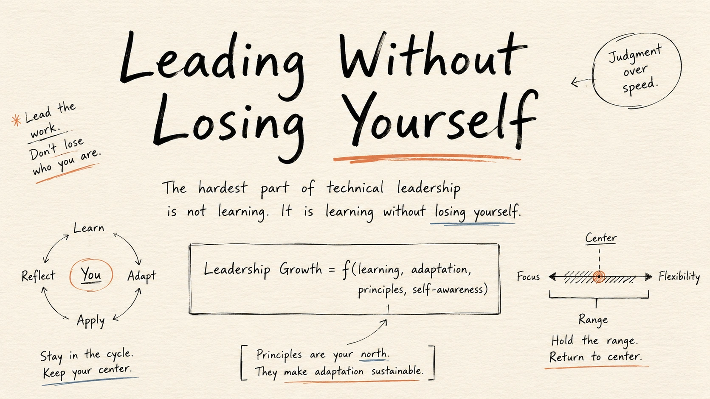

> The hardest leadership challenge is not growth. It is growth without identity erosion.

Every promotion stretches you.
New company. New culture. New expectations.

Technical leadership demands adaptation.
The challenge is evolving your methods without abandoning your principles.

Your principles stay stable.
Your execution evolves.

That tension shapes great leaders.

The hardest part of becoming a better technical leader is not learning new skills, managing larger teams, understanding business priorities, or adapting to different environments.

The harder challenge is learning without losing yourself.

Leadership stretches people in ways individual contributor work rarely does. Every promotion changes expectations. Every company introduces different cultural gravity. Every executive team communicates differently. Every organization develops its own definition of urgency, quality, ownership, and success.

Somewhere inside those transitions, leaders slowly change.

Not because they lack principles, and not because they consciously decide to compromise them, but because adaptation happens incrementally. Leaders become slightly more careful about saying uncomfortable truths. They become more tolerant of standards they would once have challenged. They learn the language that gets rewarded in a particular environment and gradually stop noticing how much of their original thinking has been replaced by organizational conditioning.

The result is rarely dramatic. Many leaders wake up years later looking successful on paper while feeling disconnected from the leadership instincts and principles that originally made them effective.

Technical leadership creates this pressure constantly because growth demands adaptation. The challenge is making sure adaptation improves capability without quietly removing identity.

## Technical leadership quietly changes you

Early in your career, the feedback loop is more direct. You write code, review code, debug production issues, improve systems, and learn the technical patterns that separate software that merely works from software that can be trusted.

Your identity is often tied to competence. You know whether you can solve the problem, understand the system, ship the work, and be trusted with hard things.

With leadership, the question shifts. You start asking whether you can create clarity when the room is confused, tell the truth when the truth is inconvenient, carry pressure without passing chaos downward, represent engineering without becoming anti-product, and support the business without becoming careless with the system.

Eventually, the harder question appears: can you adapt to the culture without becoming a copy of it?

Every company has gravity. Some companies reward speed so aggressively that quality starts sounding like fear, while others reward process so heavily that judgment slowly disappears behind ceremony. Some companies reward optimism so much that risk becomes politically expensive to mention, while others reward executive comfort so much that leaders learn how to make bad news sound harmless.

Some companies reward heroics and then wonder why systems never become sustainable.

A technical leader walks into that gravity and has to decide what to absorb, what to translate, what to resist, and what to change.

Not every cultural norm is bad. Many are simply different. A startup may need directness, speed, and high agency, while a scale-up may need operating cadence, clearer ownership, and repeatable decision-making. A larger organization may need narrative, alignment, and patience with dependencies. A turnaround may need truth before harmony. A high-growth team may need standards before freedom.

The mistake is assuming your old playbook is your identity. Your playbook should evolve, but your principles should not evaporate.

## Adaptation is required. Identity erosion is optional.

There is a difference between adapting your methods and compromising your principles.

A leader should adapt communication style, planning rituals, decision-making altitude, and the level of detail they bring to different audiences. A leader should adapt how they create alignment in a five-person team versus a fifty-person organization. A leader should adapt how they delegate, coach, review work, influence executives, and partner with Product.

This is a required healthy range, and it is not losing yourself.

Identity erosion begins somewhere else. It begins when you stop saying what you actually believe because the room does not reward it. It begins when you know the deadline is fictional but present the plan as healthy. It begins when you accept technical debt with no repayment path and call it pragmatism.

It begins when you tolerate corrosive behavior from a brilliant engineer because confrontation feels expensive, when you use your team’s exhaustion as proof of commitment, or when you become fluent in the company’s language but lose the ability to think independently inside it.

The tricky part is that identity erosion often looks like maturity at first. You become calmer, more polished, more diplomatic, and more fluent in the language of tradeoffs. To be clear, all of those can be good things.

But maturity has a counterfeit version. The counterfeit version avoids hard truths and calls it executive presence. It stops challenging weak decisions and calls it alignment. It lowers standards and calls it being practical. It becomes emotionally detached and calls it scale.

Real maturity gives you more range. Fake maturity slowly removes your edge.

## Pressure reveals what you actually believe

Leadership philosophy feels abstract until pressure arrives because pressure has a way of exposing what leaders actually believe rather than what they say they value.

Product wants the date, Engineering wants scope reduced, Sales has already hinted at the feature, Support is tired of explaining the same issue to customers, executives want confidence, and reality offers none.

The suspense: where is leadership?

Do you believe in quality only when timelines are comfortable? Do you believe in ownership only when people make decisions you agree with? Do you believe in transparency only when the news is easy to share? Do you believe in psychological safety until someone challenges your plan? Do you believe in technical excellence until the business needs a shortcut?

Most leaders do not abandon themselves in dramatic moments. They abandon themselves through small exceptions that become normal.

A rushed release. A vague status update. A skipped incident review. An unchallenged dependency. A senior person allowed to behave badly. A plan presented as green because red would create too much noise.

None of these moments feel fatal in isolation, but together they become an operating system.

Eventually, the team learns what leadership means here.

## The invisible pressure technical leaders carry

Technical leadership is filled with pressure most people do not see.

You are expected to understand the business without becoming purely business-driven, protect engineering standards without becoming precious, move fast without creating operational debt, and grow people while still delivering through them.

You are expected to give executives confidence without lying about uncertainty, support Product without becoming a ticket delivery function, absorb ambiguity without letting the team drown in it, and remain calm during incidents while being clear during planning and honest during escalation.

No wonder leaders drift.

The job constantly rewards adaptation, and adaptation can become imitation if you are not careful.

You start asking what an executive wants to hear, how leaders in this company talk, what gets rewarded here, what kind of person gets promoted here, and what you should sound like in this room.

Those are not bad questions. Every leader needs context awareness. But when those questions become louder than your own judgment, you are no longer adapting. You are outsourcing your center.

Teams can smell it.

They may not say it directly, but they know when a leader is merely translating pressure downward. They know when the leader no longer believes what they are saying. They know when every decision is optimized for optics. They know when the leader has become a spokesperson for the system instead of a thoughtful interpreter of it.

Once that happens, trust becomes thin.

## The startup-to-scale-up identity trap

One of the hardest transitions in technical leadership is moving from startup instincts to scale-up responsibility.

In a startup, speed hides many sins. You can survive with heroic engineers, informal communication, weak documentation, inconsistent process, and architecture held together by people who remember why everything was built the way it was.

At that stage, the leader who removes friction can look exceptional.

No unnecessary process. No heavy planning. No endless meetings. Just ship.

Then the company grows.

More engineers join. More customers depend on the product. More teams touch the same systems. More incidents have real business cost. More decisions need to survive beyond the people who made them.

The same leader now has to introduce structure, and that can feel like betrayal if their identity was built around being the person who removed friction.

The key distinction is whether the structure exists to protect judgment or replace it.

Bad process removes thinking, while good process preserves thinking at scale. Bad process exists because nobody trusts people, while good process exists because people deserve clarity. Bad process slows everyone down to make managers feel safe, while good process creates enough alignment for teams to move faster without constantly rediscovering the same problems.

A leader who cannot make that distinction either stays too loose for too long or becomes bureaucratic too quickly.

Both are identity failures in different directions.

## The IC-to-manager identity trap

Another hard transition is moving from individual contributor to manager.

Many technical leaders lose themselves here because they confuse distance from code with loss of value. As an engineer, you can point to the thing you built, but as a manager, your impact often appears through other people’s clarity, confidence, decisions, growth, and execution.

That can feel uncomfortable, so some managers keep reaching back into the work.

They become the reviewer of every important pull request, the hidden architect behind every decision, the person who rewrites every document, fixes every plan, and rescues every project.

Then they complain that the team lacks ownership.

But the team has learned the system.

Ownership eventually flows to wherever decisions are truly made. If every important decision comes back to the manager, the team is not immature. The system is centralized.

The opposite mistake is disappearing completely.

Some managers hear “empower the team” and interpret it as absence. They stop engaging deeply, avoid technical discussions because they do not want to micromanage, and let standards drift because they want engineers to own the work.

But empowerment without standards is neglect.

The better version is harder. Stay close enough to understand the system, but far enough to grow other people. Ask better questions, clarify decision rights, coach judgment, and create room for people to own real decisions rather than decorative ones.

You are not losing yourself because you write less code.

You may be losing yourself if you stop caring about the quality of thinking behind the code.

## Learning politics without becoming political

Every technical leader eventually learns that organizations are not purely logical systems.

Decisions happen through trust, timing, incentives, relationships, history, fear, ambition, and sometimes ego. Ignoring this does not make you principled. It makes you ineffective.

You need to understand power, incentives, resistance, timing, and the room. You need to understand why a team resists a change that looks obvious on paper, why an executive keeps asking for a metric that seems shallow, and why Product is pushing for a date that Engineering thinks is irresponsible.

But there is a line between learning organizational reality and becoming captured by it.

Political skill helps you move truth through the organization. Being political changes the truth depending on who is in the room.

A strong technical leader learns how to frame risk so the business can act on it, while a weak one hides risk until it becomes someone else’s emergency. A strong leader builds alliances around good decisions, while a weak one builds alliances around personal safety. A strong leader understands executive pressure, while a weak one passes that pressure downward and calls it accountability.

Learning politics should make you more effective at protecting reality, not better at escaping it.

## Range without center becomes performance

Leadership range is valuable because you need to speak differently with executives, engineers, product managers, customers, recruiters, peers, and board-level stakeholders.

You need different modes. Sometimes you are strategic, sometimes operational, sometimes coaching, sometimes confronting, sometimes translating, sometimes absorbing pressure, and sometimes creating pressure.

A leader with only one mode becomes predictable in a bad way. Always direct becomes careless. Always calm becomes passive. Always collaborative becomes slow. Always decisive becomes brittle. Always technical becomes narrow. Always strategic becomes disconnected.

Range matters, but range without center becomes performance.

You become whatever the room seems to need. The executive room gets confidence, the engineering room gets empathy, the product room gets partnership, and the team gets optimism. Everyone gets a version of you, but nobody gets the whole truth.

At first, that can look like leadership sophistication. Over time, it creates fragmentation because you start carrying different versions of reality in different rooms, and eventually those versions collide.

The best leaders do not say everything in every room, but they do not become different people in different rooms. While they can adjust altitude, they do not adjust integrity.

## The center must be explicit

You cannot protect a center you have not named.

Many leaders operate with vague values. Quality matters. People matter. Delivery matters. Ownership matters. Truth matters.

However, vague values collapse under pressure because pressure asks for ranking.

What matters when quality and speed collide? What matters when a high performer damages trust? What matters when the business wants certainty and engineering has uncertainty? What matters when the team wants autonomy but keeps missing commitments? What matters when saying yes protects the quarter but hurts the system?

Your leadership center needs edges.

For me, a technical leadership center might sound like this:

> I want teams that make reality visible early, convert pressure into explicit tradeoffs, protect technical standards where they affect future speed, and grow people through real ownership with honest feedback.

You may word yours differently. You should.

The point is not to create a slogan. The point is to know what you are trying to preserve while everything around you asks you to adapt.

Without that, every strong culture will reshape you, every executive will pull you, every crisis will define you, every incentive will train you, and every promotion will edit you.

One day, you may succeed your way into becoming someone you would not have trusted earlier in your career.

## A small operating model

The shape I keep coming back to is simple:

> **Leadership Growth = f(learning, adaptation, principles, self-awareness)**

Learning without adaptation becomes theory.

Adaptation without principles becomes drift.

Principles without self-awareness become rigidity.

Self-awareness without action becomes journaling.

The work is holding all four together.

Learn aggressively, adapt deliberately, protect your principles, and keep checking who you are becoming.

A leader should occasionally ask whether they are becoming more truthful or merely more polished, more effective or merely more acceptable, more mature or merely more detached. They should ask whether they are adapting their methods or lowering their standards, learning the culture or being absorbed by it, creating clarity or managing perception.

They should also ask whether they are still someone their earlier self would respect.

These questions are uncomfortable, which is part of their usefulness.

Leadership without discomfort usually means someone else is paying the cost.

## Teams need consistency more than perfection

No team needs a perfect leader because perfect leaders do not exist.

Teams need leaders whose growth makes them more trustworthy, not less recognizable. They need leaders who can enter a new culture and learn it without worshiping it, work with executives without becoming executive translators only, care about delivery without sacrificing the system, and care about people without lowering the bar.

They need leaders who can admit mistakes without making uncertainty everyone else’s burden, and they need leaders who can change their mind without changing their values every quarter.

Consistency is not sameness. A consistent leader can be flexible, evolve, be wrong, learn, apologize, and change direction. The consistency is deeper than behavior. It is the pattern of judgment.

People start to trust the way you think. They may not always agree with your decision, but they can understand the principles behind it. They can predict what you will protect. They know what kind of truth can survive around you. Ultimately, that kind of consistency compounds.

## The real challenge

The biggest change in leadership may be learning to stay steady through highs and lows, but there is something deeper underneath it.

The real challenge is becoming more capable without becoming less yourself.

Leadership will stretch you, and it should. You will learn new language, new rooms, new ways to influence, plan, delegate, challenge, communicate, and decide. You will outgrow earlier versions of yourself, ant that is not the problem.

The problem is when growth costs you your center.

A leader who refuses to change becomes obsolete, while a leader who changes into anything becomes empty.

The work is not to preserve your old self like a museum artifact. The work is to keep refining the parts of you that are true while letting go of the parts that were merely familiar.

Technical leadership is not just scaling systems. It is also scaling judgment, trust, standards, and yourself without losing the signal that made people trust you in the first place.

## The landing

Leadership maturity is not becoming someone else. It is increasing your range without abandoning your center.

Teams do not follow perfection. They follow consistency. They follow leaders who can learn without becoming hollow, adapt without becoming fake, and grow without disappearing into the expectations of every room they enter.

Keep learning, keep adapting, and keep evolving.

Just do not disappear in the process.
