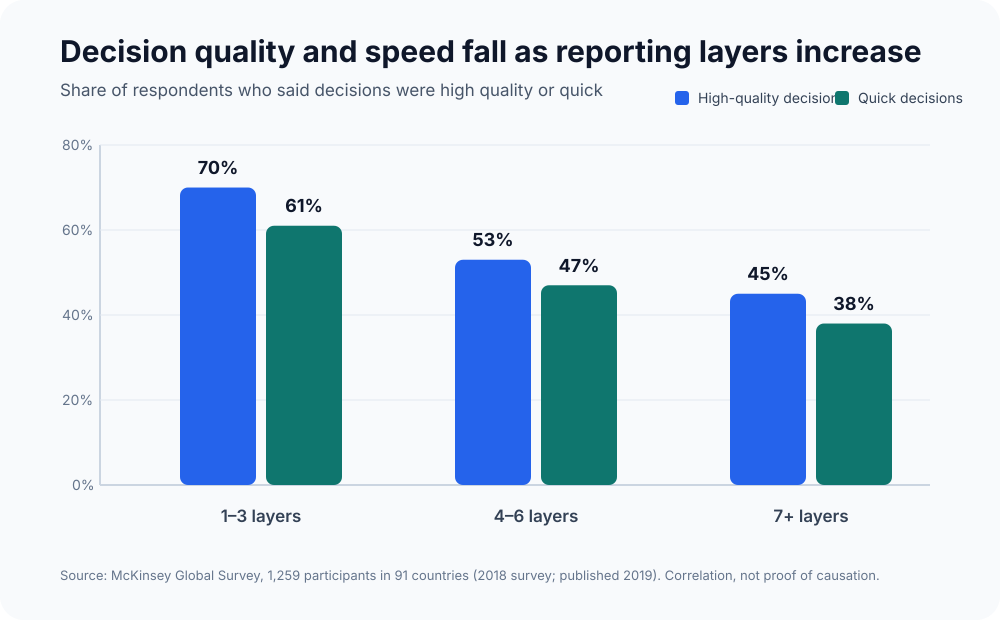
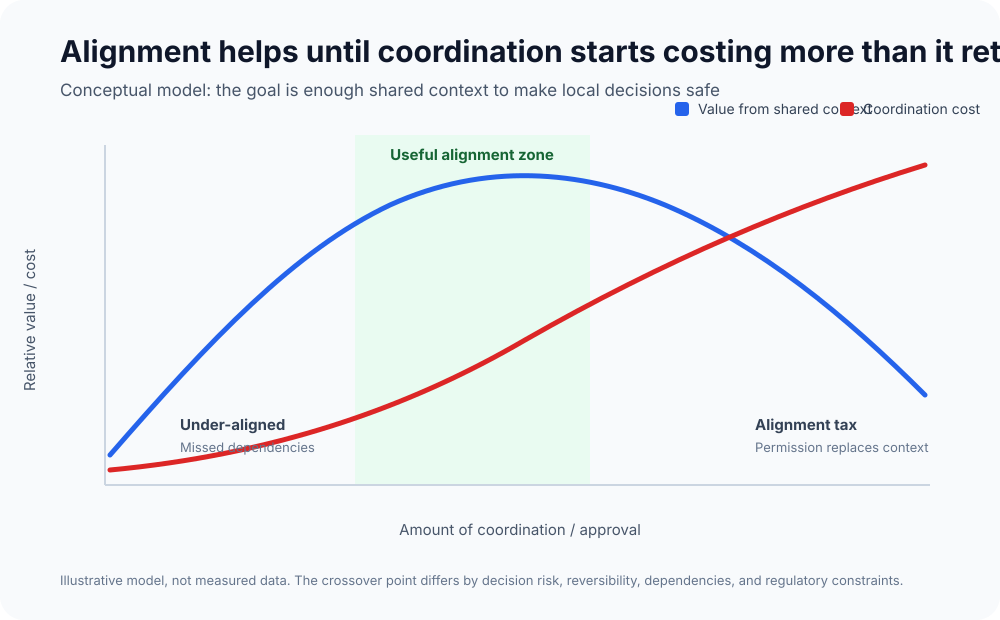
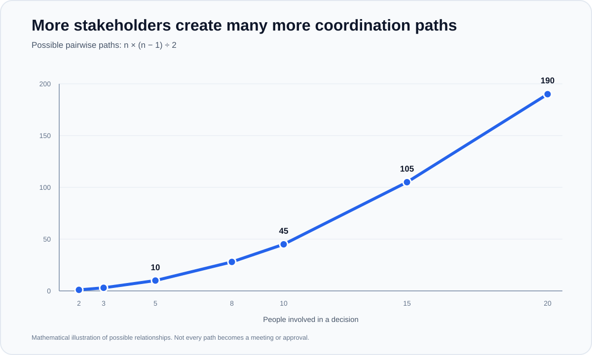
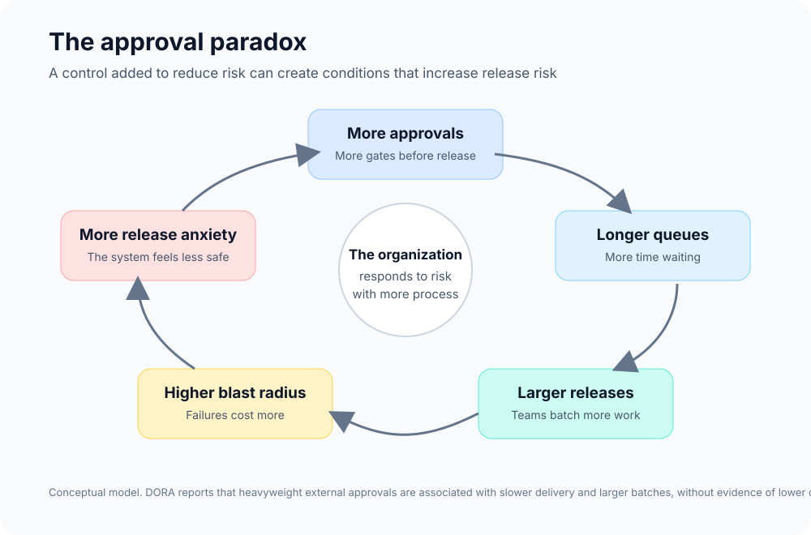

Somewhere inside a growing product company, a team has a change that should take about a week to build. Engineering understands the work, Product understands the customer problem, and nobody thinks the change is especially controversial. That is usually when the alignment starts.

The engineering manager wants confidence in the delivery plan. A senior engineer raises an architectural concern. Support wants to understand what customers will see. Go-to-market wants to know how the change will be explained. A partner team might be affected, so someone from Partnerships should probably take a look. Each request makes sense on its own, and nobody is deliberately trying to slow the work down.

A week later, someone who missed the first discussion asks a question that was already considered. The proposal changes slightly, another person wants leadership to see it before the team proceeds, and by the time everyone is comfortable, a small experiment has turned into a larger release because it now feels wasteful to go through all that process for something small.

I have seen versions of this enough times that I think there is a useful way to describe what is happening: **the alignment tax**.

I do not mean collaboration itself when I call it a tax. Large companies have real dependencies, existing customers, security requirements, contracts, shared platforms, regulatory obligations, and teams whose work can affect one another in ways that are not obvious from inside a single squad. Alignment prevents expensive mistakes, but the tax appears when shared context turns into shared control, when people who should provide useful input become informal approvers, and when the organization spends so much time becoming comfortable internally that it becomes slower at learning from customers.

## It starts reasonably

The difficult thing about the alignment tax is that almost every individual step can be defended. A support lead should explain how a change might affect customers. A security engineer should identify a security risk. A partner manager should surface a commitment made to a customer. A senior engineer should challenge an architectural choice that creates a long-term problem.

Growing companies need those perspectives. The mistake is assuming that because some alignment creates value, more alignment must create more value.

McKinsey's 2018 global decision-making survey gives a useful signal. Among 1,259 participants in 91 countries, respondents at organizations with fewer reporting layers were more likely to say decisions were both high quality and quick. Seventy percent of respondents in organizations with one to three reporting layers said decisions were high quality, compared with 53% at organizations with four to six layers and 45% with seven or more. The corresponding numbers for quick decisions were 61%, 47%, and 38%.[1]

*McKinsey's result is correlational, not proof that layers alone caused slower or weaker decisions. It still shows why adding decision distance should not be treated as free.*

The same survey found that respondents spent an average of 37% of their time making decisions, while 61% said most of their decision-making time was used ineffectively.[1] The point is not that companies should stop making decisions together. Decision-making itself consumes real capacity, and organizations rarely account for that cost when they add another review, another stakeholder, or another layer of approval.

I think alignment has diminishing returns. Early alignment can expose dependencies, clarify the customer problem, and prevent teams from moving in opposite directions. Past a certain point, each additional participant contributes less new information while adding another opportunity for delay, disagreement, context switching, and rework.

The useful point on that curve will be different for a payment migration, an A/B test, a pricing change, or a new internal tool, which is why applying the same amount of organizational attention to all of them creates unnecessary cost.

## When input becomes permission

A lot of alignment problems begin with a small language failure. We use alignment, consultation, coordination, approval, and consensus as though they mean the same thing, even though a person can be consulted without owning the decision, two teams can understand each other's direction without agreeing on every implementation detail, and someone can disagree strongly with a choice without having the authority to block it.

An approver should exist because they own a specific risk or responsibility, not because they were invited into the discussion early and gradually acquired veto power.

The difference matters more as the stakeholder list grows. With two people there is one possible pairwise communication path. Five people create ten. Ten people create 45. Fifteen create 105. Twenty create 190.

Those numbers do not mean every possible relationship becomes a meeting. They show why "let's just include these three people" changes the coordination problem faster than it appears to. A well-designed organization prevents all those possible relationships from becoming required approval paths by giving one person ownership, defining which people have relevant input, and making it clear when a decision is closed.

Without that structure, the safest behaviour is predictable. People copy more stakeholders, teams socialize decisions before the real decision meeting, Product managers learn who must be comfortable before something can move, and engineers learn which changes attract organizational attention and start avoiding them. Nobody created the bureaucracy in one step, but everyone has an incentive to keep feeding it.

## The hidden cost is waiting

Engineering teams tend to measure effort more easily than elapsed time. A security review may take thirty minutes of actual work but sit in a queue for four days. A platform team might need one hour to confirm an integration constraint but cannot look at it until next week. Product updates the proposal, then waits for another calendar slot to get everyone back together. A release can contain five days of engineering effort and still take a month to reach a customer.

DORA's research on change approval is particularly useful here because it challenges the assumption that more approval necessarily makes software safer. DORA reports that heavyweight external approvals, such as change advisory boards or senior-management gates, have a negative impact on software delivery performance. It also found no evidence that these formal external reviews were associated with lower change failure rates.[2]

DORA describes the mechanism clearly: slower approval processes encourage teams to release less often and in larger batches. Larger batches increase the impact of each release and can increase the risk the approval process was supposed to reduce.[2]

I find this loop more useful than the usual debate about whether a company has too much process. The question is whether a control actually reduces risk, or whether it creates waiting that causes teams to batch more work, increase the blast radius, and then ask for even more control.

## The alignment tax becomes a product tax

Too much alignment is usually discussed as an employee problem: engineers complain about meetings, Product managers complain about stakeholder management, and leaders complain that decisions take too long. The more expensive part is that the customer eventually pays the tax.

Imagine that a team can implement an experiment in four days, but internal discussion and approval take three weeks. The experiment then needs another two weeks in production before the team learns anything useful. The company does not have a two-week learning cycle; it has a cycle closer to six weeks.

Another company that can make the same reversible decision in two days may complete several learning loops while the first company completes one. After a year, the difference is not only how many features each company shipped. They have accumulated different amounts of knowledge about what customers want, what they ignore, what they will pay for, and which assumptions were wrong, and that accumulated knowledge compounds.

Release speed matters because every release can be a question asked of the market. Does this workflow reduce drop-off? Will customers use the new capability? Does the pricing make sense? Did the change improve conversion? Can we remove a step completely? Every unnecessary week before a safe experiment reaches customers is another week before the company can know the answer.

DORA's research on user focus makes the connection more direct. Teams with a strong user focus were associated with 40% higher organizational performance, with the research emphasizing short feedback loops, visible user metrics, and reprioritizing work based on what teams learn.[3] Seen from that angle, the alignment tax is also a learning tax.

## The customer can disappear from the room

An organization teaches people what to optimize for, even when nobody writes those incentives down. If getting a small change in front of customers is expensive, but internal agreement is mandatory, people become good at internal agreement. They learn who should see the proposal before a meeting, which objections are likely to stop it, and how to write documents that solve the customer problem while also reducing the political risk of moving forward.

None of this requires bad people or bad intentions; it is a rational response to the system. The danger is that internal confidence starts replacing external evidence. Instead of asking, "How cheaply can we test whether customers want this?" teams spend their energy asking, "How do we get everyone comfortable with this direction?" The questions sound related, but they produce different behaviours.

Microsoft's 2023 Work Trend Index gives some context for how much coordination already occupies knowledge work. Across activity measured in Microsoft 365 applications, employees spent 57% of their time communicating through meetings, email, and chat, compared with 43% creating in documents, spreadsheets, and presentations. Sixty-eight percent said they did not have enough uninterrupted focus time.[4] That dataset is not a complete measure of anyone's workday, but it is another reminder that communication has a real opportunity cost.

The customer never sees the alignment work. They only experience what eventually ships, what arrives too late, what gets diluted on the way through the organization, and what never survives long enough to be tested.

## Startups are not magically better at this

The obvious comparison is a startup where five people can make a product decision around one table and ship the change the same afternoon. Startups often are faster, but part of that speed comes from structural advantages: fewer existing customers to disrupt, fewer integrations, fewer contracts, fewer reporting layers, fewer shared systems, and much less organizational history. The same founder may also hold product context, customer context, and final decision authority at the same time.

Some startup speed is deferred cost. Teams can move quickly while accumulating security problems, weak controls, undocumented decisions, duplicated infrastructure, architectural fragmentation, and founder bottlenecks that become painful later.

Large companies cannot solve their alignment problem by pretending they are ten-person startups. A better question is how to preserve decision speed while adding the controls that scale genuinely requires, which makes this an organizational design problem rather than a meeting problem.

## Alignment should buy autonomy

The purpose of alignment should be to reduce the amount of coordination a team needs during execution. If a team understands the customer problem, the business objective, the technical boundaries, the acceptable risks, and the success metrics, it should be able to make many implementation decisions without bringing the whole organization back into the room.

Netflix describes a similar idea as "context, not control." Its culture memo says managers should give teams enough context and clarity to make good decisions, while significant decisions have an "informed captain" rather than being made by committee.[5] GitLab makes the ownership principle even more explicit by pushing decisions to the lowest possible level and assigning a directly responsible individual, or DRI.[6]

The details will not transfer perfectly to every company, but the pattern is useful because broad input does not require broad decision authority. A scalable decision system should answer a few questions before the discussion becomes large:

- What decision are we actually making?
- Who owns it?
- Who has information that the owner needs?
- Who owns a risk that can genuinely block the decision?
- When does the decision close?
- What new evidence would justify reopening it?

The questions are simple, but they remove a surprising amount of ambiguity before that ambiguity turns into coordination work.

## Treat different decisions differently

Amazon's one-way-door and two-way-door model remains useful because it starts with reversibility rather than hierarchy. One-way-door decisions have significant and difficult-to-reverse consequences, while two-way-door decisions can be reversed or corrected with relatively limited cost.[7]

A payment architecture migration, a major contract, or a change with regulatory consequences deserves more scrutiny than an experiment behind a feature flag. Treating both as though they carry the same risk wastes organizational attention and slows learning where the downside is already contained.

A practical version looks something like this:

| Decision | Useful default |
| --- | --- |
| Local and reversible | One owner decides after getting the context they need |
| Cross-team but reversible | One owner, time-boxed input, parallel dependency checks |
| Difficult to reverse | Formal review with clearly named approvers and one final decider |
| Regulated, security-sensitive, or financially material | Mandatory specialist controls, automated where possible |

The goal is not fewer controls everywhere. It is spending alignment where a wrong decision is expensive to undo and using experimentation where the organization can learn safely.

## Move recurring alignment into the system

Engineering already has a good mental model for this problem because if every service had to understand the implementation details of every other service before making a change, software would become almost impossible to evolve. We create interfaces, contracts, ownership boundaries, automated tests, observability, and deployment controls so parts of the system can change independently without coordinating with everything around them.

Organizations can apply the same idea. If every team must remember the same security requirements, logging standards, deployment steps, rollback expectations, access controls, and service metadata before shipping, those requirements do not all need to remain conversations. Some belong in templates, CI checks, platform tooling, policies, feature flags, automated rollbacks, and paved roads.

Spotify's experience with Golden Paths is a good example. As autonomous teams grew, Spotify found that fragmented developer tooling and what it called "rumour-driven development" no longer scaled. Golden Paths provided opinionated, supported routes for common engineering work without removing the ability to leave the path when a team had a good reason.[8]

DORA makes a similar recommendation for change management: move validation into peer review, continuous testing, monitoring, and the development platform rather than relying on people far from the change to manually inspect every release.[2]

Regulated environments make the distinction more important, not less. A payments, banking, healthcare, or insurance team cannot treat compliance, privacy, segregation of duties, or auditability as an implementation preference, and some changes will genuinely require specialist review or explicit sign-off. But many requirements define controls, evidence, and accountability without requiring every change to pass through the same manual sequence. Teams can pre-approve common architectures, encode policy checks into CI and infrastructure, generate audit evidence automatically, and reserve additional human review for changes that leave the approved path or materially change the risk profile.

The organization keeps the control but changes its form. Instead of asking a person for permission every time, it encodes repeatable knowledge into the system and saves human attention for cases that actually require judgment. In engineering organizations, some of the most scalable alignment will therefore look less like another meeting and more like better infrastructure.

## Measure the wait, not only the build

Companies often have detailed engineering metrics while decision friction remains mostly invisible. If a feature takes five engineering days but forty calendar days to reach production, something consumed the other thirty-five. Without measuring that gap, the organization can keep pushing engineering teams to move faster while leaving the real bottleneck untouched.

Standard delivery measures such as lead time for changes and cycle time are still useful, but they can miss part of this problem when the largest delay happens before implementation starts or while work is waiting outside the engineering workflow. I would pair them with a small set of measures that expose where elapsed time is actually going:

| Metric | What it reveals |
| --- | --- |
| Decision latency | First serious proposal to a decision that lets the team proceed |
| Approval wait time | Time spent waiting for required reviewers, separate from the time they spend reviewing |
| Code-complete-to-production | How long ready work waits before customers can use it |
| Experiment lead time | Product hypothesis to the first usable customer evidence |
| Decision reopen rate | How often closed decisions are reopened without material new evidence |
| Wait share | Waiting time as a percentage of total elapsed delivery time |

These do not need to become another dashboard that teams optimize for. They are diagnostic measures. If a change involves six days of active work but takes thirty calendar days to reach production, a wait share near 80% tells a very different story from one where most of those thirty days were spent building and testing the product.

Those measures tell you whether the organization is becoming easier or harder to move through, and they change the conversation. Instead of "Engineering needs to deliver faster," leaders can ask why a four-day implementation required twenty-five days of organizational elapsed time. Sometimes the answer will be a legitimate constraint. Other times it will expose approval queues, unclear ownership, serial reviews, or a control that exists because nobody has revisited why it was created.

## A better definition of alignment

As companies grow, alignment becomes more important because the consequences of independent decisions grow with them. I do not think the answer is fewer conversations for the sake of fewer conversations, and I do not think every company should copy startup informality. The better goal is to make alignment produce autonomy.

Teams should share the mission, customer problem, constraints, interfaces, and measures of success. People with relevant expertise should be able to challenge assumptions and surface risks, and decisions with large or irreversible consequences should receive the scrutiny they deserve. Once that context is in place, the organization should be able to let people act.

Alignment has done its job when it makes the next decision easier to make without everybody being present. When every decision creates another round of alignment, the company has not reduced uncertainty; it has distributed decision authority so widely that nobody can move without permission.

Customers do not experience how aligned a company was internally. They experience what the company was able to turn that alignment into.

## References

- [McKinsey - Decision making in the age of urgency][1]
- [DORA - Streamlining change approval][2]
- [DORA - User-centric focus][3]
- [Microsoft - 2023 Work Trend Index: Will AI Fix Work?][4]
- [Netflix - Culture Memo][5]
- [GitLab - Decision Velocity][6]
- [AWS - Elements of Amazon's Day 1 Culture][7]
- [Spotify Engineering - How We Use Golden Paths to Solve Fragmentation in Our Software Ecosystem][8]

[1]: https://www.mckinsey.com/capabilities/people-and-organizational-performance/our-insights/decision-making-in-the-age-of-urgency
[2]: https://dora.dev/capabilities/streamlining-change-approval/
[3]: https://dora.dev/capabilities/user-centric-focus/
[4]: https://www.microsoft.com/en-us/worklab/work-trend-index/will-ai-fix-work
[5]: https://jobs.netflix.com/culture
[6]: https://handbook.gitlab.com/teamops/decision-velocity/
[7]: https://aws.amazon.com/executive-insights/content/how-amazon-defines-and-operationalizes-a-day-1-culture/
[8]: https://engineering.atspotify.com/2020/8/how-we-use-golden-paths-to-solve-fragmentation-in-our-software-ecosystem
