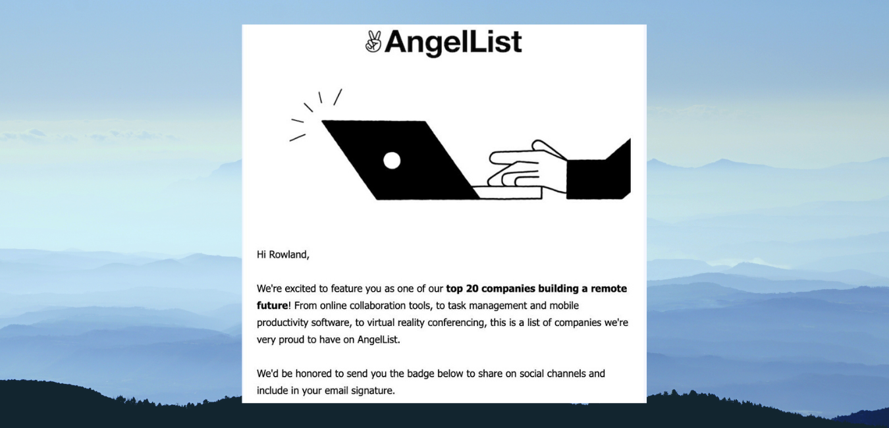

> This post is my reflection from the eye of a founder, and I believe that it can help you.

I have worked with [GitStart](https://gitstart.com) for three years and two months and have seen low and aha moments in the short spell. I've interviewed candidates from different continents; worked with Engineers, CTOs, and CEOs from various companies and product offerings. I've bootstrapped distributed Engineering teams and managed developer growth. I've experienced what it means to run lean operations and navigating through the path of customer success. I've seen client frustration. Also, sometimes I'm left with no other option than to make some strong calls to fire people who can no longer grow with us. I'm deeply grateful for these experiences.

My goal here is not to separate failure from success but to reflect on the journey and glean few lessons without going into too many details as they're numerous.

> Experience is only a process in the learning path. Reflection is a gem to aggregate the lessons.

#### 1) [Problem & Patience] It's hard to solve a problem you don't fully understand

- If you're patient enough to understand a problem, your solution will be magical. So, learning the problem is part of building a solution.

#### 2) [Hiring] Better to develop and promote than hire

- You may not need to hire from the outside if you pay attention to employee growth and promotion.
- Hiring is expensive, and onboarding is not without hassles.

#### 3) [Hiring] Don't hire a specialist too quick

- Only hire a specialist if you know what the problem is, and you've tried a solution that's somewhat working. Hiring a specialist earlier may drain your resources.

#### 4) [Hiring] Before you fire, make sure you answer the WHY AND HOW question.

You want to hire, and you have the power to fire as well, but you must use the authority prudently.

#### 5) [Hiring] Before you hire, define at least ~90% of what you're hiring for. Otherwise, you waste resources.

#### 6) [Hiring] Talent is not scarce; the problem is where and what you're looking for

- Talent is not scarce; skill may be. The factor that fills the gap is opportunity.
- Focus on qualities that are hard to learn. Skill is easy to learn with the right trait and environment.
- Don't confuse talent with experience.
- Underdogs might be your most accessible route to bootstrap your company before wasting funds on expensive execs for the sake of PR. Underdogs are not cheap labor. They're talents without opportunities and exposure. Also, you don't want too many specialists without generalists.

#### 7) [Hiring] Resist the pressure to expand your team without counting the cost.

#### 8) [Culture] Transparency will win you more battles, and it's a solid foundation for people-oriented culture.

#### 9) [Culture] Culture suffers when vision is not driving execution.

#### 10) [Culture] Every feedback received creates a cycle of accountability.

- Always address the feedback with actionable items; else, you close the loop.

#### 11) [Culture] Alignment to company vision enables autonomy

- Alignment and autonomy are friends in building a great culture.

#### 12) [Culture] Building a culture is complex, especially under the pressure of growth.

- Growth is a variable. Culture can enable sustainable growth, so don't allow lack of funds or much of it to define your culture.
- Put the culture in the list of the non-negotiables.

#### 13) [Leadership]: If you own all parts of the process, you will micro-manage unintentionally

- Delegate, trust and support but don't own every process.

#### 14) [Leadership] As a founder, when things go well, the team is phenomenal. When it goes soar, you take the blame.

- Get used to it.
- Isn't that what Leadership is? Be responsible for the failure.

#### 15) [Leadership] Don't focus on who made a mistake

- Please focus on the mistake, how to fix it and how to mitigate it in the future.
- The person that made a mistake might be the best solution provider.

#### 16) [Leadership] Trust easily but hate control

- You may lose sometimes, but nothing motivates like trust.
- In 2017, I got a contract from a client far away from my country. We've never met before. No one recommended me. After the interview, he onboarded me and paid me the first month's contract pay even before I started work. When I asked, He said I want you to know I trust you. That was a defining moment for me. I lead the migration of the 20-year-old Perl site(Frontend piece) to ReactJS in ~3months.

#### 17) [Leadership] Celebrate the unsung heroes in your team

- Be on the lookout for tiny improvements and amplify them.
- Praise motivates and builds trust.

#### 18) [CEO] The CEO's biggest job is to sell

- Sell to customers
- Sell to Employees/coworkers.
- Sell to investors
  If you're not confident to sell, then you don't believe enough. If you don't sell, you may never get the feedback to improve.

#### 19) [Management] It is better to focus on WHY & WHAT needs to be done/built than HOW to make them.

- Your team will figure HOW. Give your team the support(mentorship, resources, and motivation).
- You may never escape micromanaging your team if you get into the rabbit hole of HOWs all the time.
- If you believe you hired smart people, let them figure it out while waiting to support.

#### 20) [Operations] Don't scale operations for what automation can handle.

- Automation may be the antidote to avoid massive management & financial overhead.

#### 21) [Career growth] Be pragmatic and proactive about defining career paths early on to help with retention and to guide employees on the path of success.

#### 22) [Career Growth] Agree to part ways when you can't grow any longer with any hire(employee).

- It's better to part ways amicably than have an avoidable rusty relationship.

#### 23) [Career Growth] Your coworkers/employees joined you to build their careers and not just for the paycheck.

#### 24) [Engineering] Don't go too far when experimenting

- It's easy to waste Engineering resources without research.
- Experiments are great, howbeit be mindful of your resources.

#### 25) [Engineering] When building mission-critical parts of your product or company, please add a fallback.

- Something is likely to fail in the demo.

#### 26) [Community] Building a community is better than being rigid about structure.

- Dissolve into teams, create enormous opportunities for creativity, learning, growth.
- A company as a community gives a sense of belonging to the bigger picture.

#### 27) [Customer success] Optimize for retention and not immediate profit

- Your customer shouldn't feel they're losing. It's OK to take the blame, share agreeable action items and keep the relationship alive.

#### 28) [Advisors] If you can't hire experienced, keyword being experienced, not expensive folks, get advisors on board earlier.

- Either way, get senior advisors.

#### 29) [Business] If you can't figure out your business model, get help.

- You may end up spending more money on tech while the business suffers.
- Tech folks are not guaranteed to be successful because they're building a tech company.

#### 30) [Outsource] Be immersed in your core problem and outsource everything else.

- When to outsource is a question to answer, but awareness is essential.

Thanks for reading!

Let me know your thoughts.
